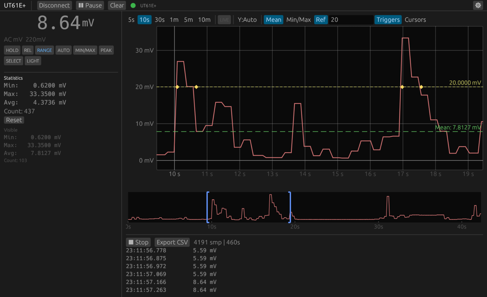

# dmm-tools

[](https://github.com/antoinecellerier/dmm-tools/actions/workflows/ci.yml)
[](https://github.com/antoinecellerier/dmm-tools/releases)
[](LICENSE)

Read, record, and remote-control digital multimeters over USB. Supports UNI-T and Voltcraft meters — see [supported devices](#supported-devices).

Includes a CLI with text/CSV/JSON output and a GUI with real-time graphing.



## [CLI](docs/cli-reference.md)

- Live measurement streaming with text, CSV, and JSON output
- Coulomb counting / energy integration (`--integrate`)
- Remote control — send button presses over USB
- Guided protocol capture wizard for bug reports

```
$ dmm-cli read --count 5
9.090 MΩ [AUTO]
8.902 MΩ [AUTO]
10.182 MΩ [AUTO]
9.399 MΩ [AUTO]
9.176 MΩ [AUTO]

--- 5 samples | Min: 8.9020 | Max: 10.1820 | Avg: 9.3498
```

Output as JSON for scripting:

```
$ dmm-cli read --format json --count 1
{"display_raw":"  3.369","flags":{"auto_range":true,"dc":false,"hold":false,...},"mode":"DC V","range":"22V","unit":"V","value":3.369}
```

Send remote commands:

```
$ dmm-cli command hold
Sent hold
```

Connect to other device families with `--device`:

```
$ dmm-cli --device ut8803 capture
WARNING: UNI-T UT8803 support is EXPERIMENTAL (unverified against real hardware).
```

## [GUI](docs/gui-reference.md)

- Real-time value display and time-series graph with minimap
- Statistics, cursor measurements, reference lines with threshold triggers
- Live specifications (resolution, accuracy) for the current range
- Recording with CSV export and remote control buttons
- Big meter mode for bench-mount use

## Supported devices

| Family | Models | Status |
|--------|--------|--------|
| UT61+/UT161 | UT61E+, UT61B+, UT61D+, UT161B/D/E | ✅ Verified (UT61E+; [other models](https://github.com/antoinecellerier/dmm-tools/issues/7)) |
| UT8802 | UT8802, UT8802N | [🧪 Experimental](https://github.com/antoinecellerier/dmm-tools/issues/12) |
| UT8803 | UT8803, UT8803E | [🧪 Experimental](https://github.com/antoinecellerier/dmm-tools/issues/3) |
| UT803/UT804 | UT803, UT804 | 🧪 Experimental ([#15](https://github.com/antoinecellerier/dmm-tools/issues/15), [#16](https://github.com/antoinecellerier/dmm-tools/issues/16)) |
| UT171 | UT171A/B/C | [🧪 Experimental](https://github.com/antoinecellerier/dmm-tools/issues/4) |
| UT181A | UT181A | [🧪 Experimental](https://github.com/antoinecellerier/dmm-tools/issues/5) |
| VC-880/VC650BT | Voltcraft VC-880, VC650BT | [🧪 Experimental](https://github.com/antoinecellerier/dmm-tools/issues/13) |
| VC-890 | Voltcraft VC-890 | [🧪 Experimental](https://github.com/antoinecellerier/dmm-tools/issues/14) |

🧪 = reverse-engineered from vendor software, not yet tested on real hardware — click to help verify.

See [docs/supported-devices.md](docs/supported-devices.md) for the full compatibility list and reference implementations.

## Quick start

Pre-built binaries for Linux, Windows, and macOS are available on the [Releases](https://github.com/antoinecellerier/dmm-tools/releases) page. Or install from source:

```sh
cargo install --git https://github.com/antoinecellerier/dmm-tools.git dmm-cli
cargo install --git https://github.com/antoinecellerier/dmm-tools.git dmm-gui
```

```sh
dmm-cli read            # stream measurements
dmm-gui                 # launch the GUI
```

See [setup & troubleshooting](docs/setup.md) for driver installation, udev rules, and platform-specific instructions.

## Documentation

- [CLI reference](docs/cli-reference.md)
- [GUI reference](docs/gui-reference.md)
- [Setup & troubleshooting](docs/setup.md)
- [Architecture](docs/architecture.md)
- [Protocol details](docs/protocol.md)
- [UX design](docs/ux-design.md)
- [Development guide](docs/development.md)
- [Changelog](CHANGELOG.md)

## Contributing

See [CONTRIBUTING.md](CONTRIBUTING.md) for how to submit bug reports, protocol captures, and code changes.

## License

GPL-3.0-or-later. See [LICENSE](LICENSE) for details.


## References

- [ljakob/unit_ut61eplus](https://github.com/ljakob/unit_ut61eplus) — Protocol reverse engineering and Python implementation
- [mwuertinger/ut61ep](https://github.com/mwuertinger/ut61ep) — Protocol reverse engineering and Go implementation
- [Silicon Labs AN434](https://www.silabs.com/documents/public/application-notes/an434-cp2110-4-interface-specification.pdf) — CP2110/4 HID-to-UART interface specification
- [UT61B+/D+/E+ | User Manual](https://meters.uni-trend.com/download/ut61b-d-e-user-manual/) - UNI-T user manual
