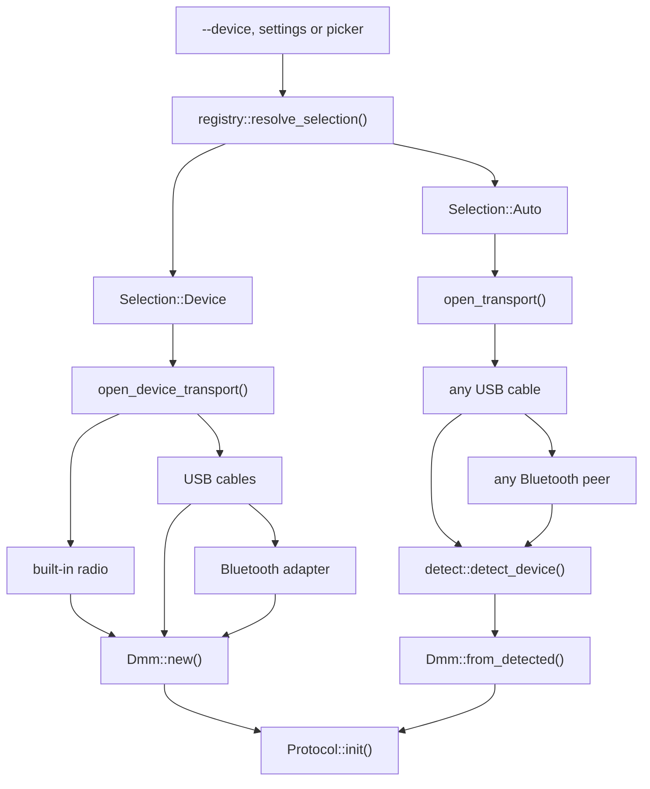
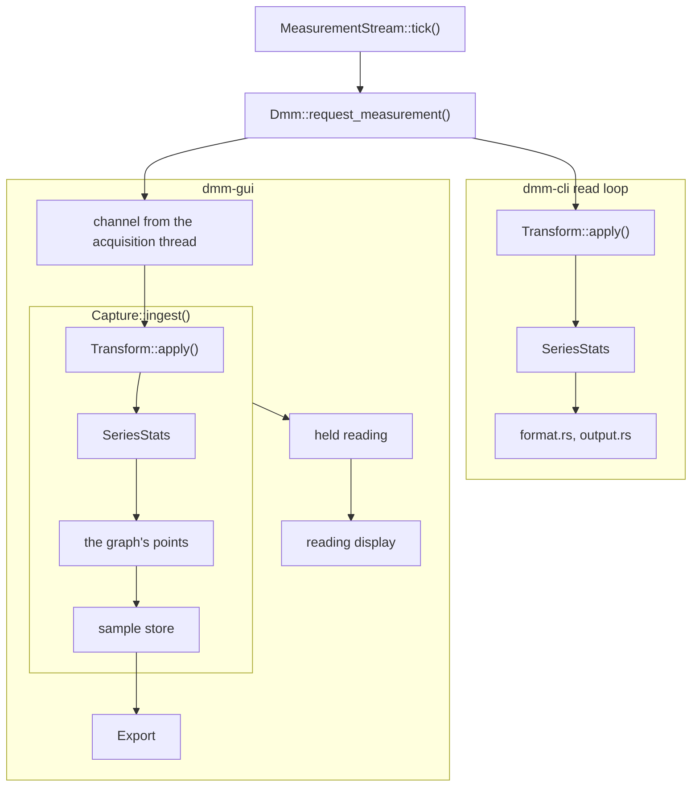

# Architecture

How the crates fit together and why. Each section names the files to open next; the mechanism,
edge cases and constants live in their doc comments.

## Overview

The layering is `dmm-lib` ← `dmm-shared` ← `dmm-cli`, `dmm-gui`: each crate depends only on the
ones to its left.

**`dmm-lib`** talks to meters. It owns the transports, the protocol families, the device registry,
detection, the acquisition loop and the session clock. It has no UI code and no opinion about
config files or export names. It stays self-contained: only `hidapi`, `thiserror`, `log`, and,
behind the `bluetooth` feature, `btleplug` with the `tokio` and `futures` its API needs, plus on
Windows the `windows` crate for the one WinRT call btleplug cannot make. No external utility crates.
Protocol internals are `pub(crate)`: consumers use `Dmm` and the registry.

**`dmm-shared`** holds what the two binaries must agree on and `dmm-lib` must not carry: the
settings file, durable writes, what an export holds and is called, what `--replay` opens, the help
text and the default log levels. Device, protocol and transport code stays in `dmm-lib`. Anything
one binary alone needs stays in that binary.

**`dmm-cli`** is a `clap` binary, and **`dmm-gui`** an `eframe`/`egui` one. Neither holds protocol
logic or knows a device by name, except the mock: both get their devices from the registry.

## Core concepts

- **Transport and link.** `Transport` is a link's byte I/O: a USB-HID bridge, a Bluetooth LE peer,
  or a mock. `Transport::link()` says what the meter is on (`Link::UsbCable`, `Link::Bluetooth`).
  Behaviour and user-facing wording key on the link, never on the bridge chip.
- **Protocol and delivery.** `Protocol` is one family's framing, parsing and commands. Every family
  produces the same `Measurement`. `Protocol::delivery()` says whether the meter answers requests
  (`Delivery::Polled`) or sends readings on its own (`Delivery::Streamed`).
- **Measurement.** One reading, protocol-agnostic: mode, value, unit, range, flags, and sub-values
  (`AuxValue`) for meters with more than one display. When a meter sends the parts of one reading
  in separate frames, they are not paired up: a frame without the main reading carries
  `MeasuredValue::Absent` and its part as a sub-value, so every frame keeps its own timestamp and
  wire bytes: a replay stays complete, and an export row is one frame.
- **Registry entry.** A `SelectableDevice`: one selectable model with its id, names, activation
  help, links, protocol factory and fingerprint. Each family keeps its entries in its `devices.rs`,
  and `DEVICES` orders them.
- **Fingerprint.** A family's part in auto-detection: the probe it sends, the families whose probes
  must go out first, and the rule that recognises its frames, built from the constants it already
  puts on the wire.
- **`Dmm`.** The handle a binary holds: a transport and a `Box<dyn Protocol>`. Every reading,
  command and name request goes through it ([Acquisition and timing](#acquisition-and-timing)).
- **`MeasurementStream`.** The acquisition loop around a `Dmm`: the sample interval and the count of
  consecutive timeouts. The CLI and the GUI share it.
- **`Clock`.** The session's time base: real, scaled (optionally with an instant pre-seed burst), or
  manual for tests.

## Data flow

Connecting, from what the user picked to an initialised meter:

A named meter is opened on its own links; `auto` takes the first cable, or else any adapter or meter
in range, and detection picks the entry (see [Opening a meter](#opening-a-meter)). Either way `Dmm`
asks the meter's name first when the protocol wants it, then runs `Protocol::init`. The binaries
enter through `open_device_by_id_auto()` and `open_auto()`, or through `open_transport()` and
`open_device_transport()` when they wrap the transport first.

Reading, from one tick to every output:

Three things the diagram does not show. A streaming meter's every frame is read, and the one
nearest the tick is kept. Stamping and spec data happen in one place, `Dmm::request_measurement`
([Acquisition and timing](#acquisition-and-timing)). In the GUI the display comes last: it shows
the reading `Capture::ingest` returns, after the graph and the store have taken it.

## Subsystems

### Opening a meter

`OpenOptions` carries the `--adapter` selector and whether Bluetooth may be scanned. An open for a
named entry tries the cables listed in its `links` first, then falls back to the other bridges, so an
unusual cable pairing still connects. The fallback reaches only cables that relay the meter's UART
bytes. A cable that speaks its meters' protocol itself is opened only for an entry that lists it,
or last for `auto`. The same rule vets an `--adapter` link before its bridge is initialised: a
link the entry cannot be on fails with `Error::WrongCable`.

USB comes first. If nothing answers there, the radio gets a turn, provided the entry lists
Bluetooth and scanning is allowed. The caller names the peers it takes by advertised name: an entry
behind an adapter takes adapters; a meter with a built-in radio takes the peers its
`bluetooth_names` match; `auto` and `list` take all of them. So an open for one meter never lands on
another. An entry with `bluetooth_names` is looked for over Bluetooth alone, and says why it was
not found with `Error::BluetoothOnly`. `list_devices()` stays instant because it backs a GUI control;
`list_bluetooth_devices()` scans.

For `auto`, the opener takes the first bridge that answers and `detect.rs` identifies the meter on
it. Each family exports a `Fingerprint`, and `detect.rs` is the engine that runs them. Which ones
run comes from the registry entries that list that link. On a Bluetooth peer whose advertised name
(`Transport::advertised_name()`) belongs to registry entries, only those entries' fingerprints run.
A peer's GATT profile may also read one characteristic at bring-up, whose value
(`Transport::info_characteristic()`) is the protocol's to read. Either way the transport reports
what the link carries and knows no model. The cascade and its failure modes are in
[detection-design.md](detection-design.md).

Code: `transport/open.rs`, the open and list functions in `lib.rs`, `protocol/registry.rs`,
`transport/ble/`, `detect.rs`.

### Remote control

There are two paths. `send_command()` sends a named button press and reads nothing back.
`choices(Setting, &Measurement)` lists the values a setting can take from where the meter sits, and
`select(Setting, id)` switches to one and confirms it from the stream. A family whose meter takes an
absolute command sends it. A family that can only press buttons goes through the cycle driver
(`protocol/cycle.rs`), which presses and reads back until the target shows. The mock does too, so a
choice list that works on it works on hardware. `choices` and `select` default to unsupported, and
the CLI and GUI hide a setting whose list has fewer than two entries.

A profile can also list keys for a GUI to draw by data rather than by command name
(`DeviceProfile::meter_keys`): function keys that pick a function, and context keys offered while
they apply to the reading. Each is one of the profile's commands, sent through `send_command()`.

Code: `protocol/mod.rs` (`Setting`, `Choice`, `MeterKeys`), `protocol/cycle.rs`.

### Acquisition and timing

`MeasurementStream` is the loop the CLI's `read` and `debug` and the GUI's thread share. It asks a
polled meter on absolute ticks. It reads a streaming meter continuously and keeps the frame nearest
each tick, so every frame is read, and stamped, as it arrives. It also spots a link that hands a
streaming meter's readings over two at a time, and passes on the link's own notice about it
(`Transport::late_readings`) for the binary to show. Cancellation stays with the caller.

`Dmm::request_measurement` stamps every reading with the session `Clock` and its `wall_time`, and
attaches the spec data. Stamping in one place means the statistics, the graph, the recording and
the exports follow the clock without knowing it exists. Hardware timeouts, settle delays and
bring-up sleeps stay on real time: they pace physical USB.

Before a read, a command or a switch that must see the meter as it is now, `Dmm` drops what the
meter sent that nobody read (`Protocol::discard_input()`). A streaming meter queues frames the whole
time it goes unread: a pause, a reconnect, detection. A polled meter queues only a reply that came
after its request timed out.

Code: `stream.rs`, `clock.rs`, `Dmm` in `lib.rs`, `discard_queued()` in `protocol/framing.rs`.

### Replay and mock

A `Replay` is a recorded session opened as a device. It plays each payload back through the
family's own `Protocol::parse_payload`, as a streaming meter would send it, so a replayed reading
decodes exactly as the live one did. Read-only calls delegate to the family's protocol, and commands
are refused. The clock's wall origin is pinned to the recording's time and each reading keeps the
session time it was recorded at, so exports of a replay carry the recording's own timestamps. Past
the last payload the session has ended (`Protocol::ended`, `StreamEvent::Ended`). The file writer
lives beside the parser, so a recorder cannot drift from it.

`MockProtocol` is the hardware-free meter the GUI, the CLI demos and the screenshots run against. It
reaches its settings through the same cycle driver as the button-cycling families. A simulated
meter wraps the family's unchanged driver around an in-memory transport that streams the family's
own packets and takes the key frames the driver writes. `mock::open_simulated` opens either by its
registry entry.

Code: `replay.rs`, `mock/`.

### Exports and settings

`dmm-shared` holds one builder and one reader per export format, and the default file name that
the GUI's Export… and `dmm-cli read -o` given no file name both use. So the two binaries write the
same files, and a field added to a reading reaches both at once. The settings file is shared the
same way (see **One settings type for both binaries**).

Code: `crates/dmm-shared/src/lib.rs`, `export/`.

### CLI

One module per subcommand under `cmd/`, except `capture`, which has a module of its own,
`capture/`. All of them open the meter through `open.rs`. `read` formats
each reading (`format.rs`) and writes it where the run says (`output.rs`). `capture` is the guided
run that walks a meter through its protocol's steps and writes a YAML report with the raw bytes; its
design is in [capture-design.md](capture-design.md). User-facing behaviour is in
[cli-reference.md](cli-reference.md).

### GUI

Device I/O runs on a background `std::thread`. Three `mpsc` channels connect it to the UI: messages
out (readings, connection events), `ThreadControl` in (pause, sample interval), and remote commands
in. The UI stops the thread by dropping its sender. Pause halts acquisition in the thread; it is
not a display freeze.

`App` is declared once in `app/mod.rs`. Every module under `app/` adds `impl App` methods to it, so
no panel owns state of its own. Each reading goes through `Capture::ingest()`, then the reading
display.

The graph draws in two tiers (see **Graph two-tier rendering** below). Behind the graph's points,
the full readings live in one sample store (`Recording`); a recording is a slice of it. Markers are
kept apart from the graph and the store, pinned to a reading: the graph restarts on a mode change
while a recording carries on, so neither outlives the other.

The daily update check is the only network access in the workspace. It runs only in published
builds, and sits behind the default `update-check` feature: without it no HTTP or TLS crate is
built in. User-facing behaviour is in [gui-reference.md](gui-reference.md).

Code: `app/connection.rs` and `app/messages.rs` (thread and channel), `app/capture.rs`,
`recording.rs`, `markers.rs`, `graph/`, `app/update_check.rs`.

## Design decisions

**Sync, not async.** A session drives one meter over a slow, byte-paced link, and blocking calls
keep the stack simple. Bluetooth's async stack is kept inside its transport (see below).

**Direct hidapi, no `cp211x_uart`.** That crate has been unmaintained since 2017, and the CP2110
layer we need is small.

**hidapi's hidraw backend on Linux.** It talks through the kernel's HID driver instead of detaching
it, and the udev rule in [setup.md](setup.md) grants access to the `/dev/hidraw` node.

**Traits at the two seams.** `Transport` lets tests run on `MockTransport` without hardware.
`Protocol` is object-safe and `Send`, so `Dmm` dispatches through `Box<dyn Protocol>` and no caller
knows the family at compile time.

**The registry is the only device list.** Names, aliases, activation help, links, manual URLs and
protocol factories live in `SelectableDevice` entries beside each family's code. The binaries
consume the registry and match on no family, so a new device needs no app code.

**One settings type for both binaries.** `SharedSettings` is one Rust type: the GUI flattens it into
its own `Settings`, so the file stays flat, and the CLI reads the same file into it and ignores the
GUI's fields. Renaming or retyping a shared field breaks both builds at once, rather than one
binary silently losing the setting.

**Per-model tables behind a trait.** Where a family's models share one driver, what differs sits
behind a per-model trait (`ModeTables`, `Vc8x0Model`), so a model is one implementation plus its
spec tables.

**No parser combinators.** Frames are short and positional, so direct indexing reads more clearly
than `nom`, and `dmm-lib` stays within its dependency rule.

**Static strings in readings.** `mode`, `unit` and `range_label` are `Cow<'static, str>`: a live
reading borrows table data and allocates nothing for them.

**Static spec data.** Resolution, accuracy and per-mode notes are `&'static` tables in each family,
transcribed from the manuals. `Protocol::spec_info` takes the whole reading, so a family can pick
the table by more than mode and range.

**Derived series model.** A frame is named series (`Main` and each sub-value); a derived series is a
(label, unit, op) triple over them, and a re-expression replaces `Main`, keeping the meter's value
as `Raw`. Transforms run at one point per binary, before any fan-out, so every output agrees.

**Name the target, confirm from the stream.** `select()` never trusts a press: only the meter's
reading confirms it. An undrivable setting fails before any I/O, an unperformed switch after it;
both are configuration errors, so the GUI reports them and keeps streaming.

**Session clock.** One `Clock` is shared by `Dmm`, the mock's waveform and the pacing loop. So a
scaled, pre-seeded or manual session stays consistent with its own timestamps, and screenshots and
tests need not wait.

**Unrecognised data asks for a report, once.** Data outside a parser's spec goes through
`report_unknown()`, which warns on its first call of the process and logs later calls at DEBUG. A
meter parked on an unknown value would otherwise repeat it every frame.

**Bluetooth runs only inside its own calls.** Behind the default-on `bluetooth` feature, the
transport runs each `btleplug` call in `block_on` on the caller's thread: no thread, no channel, as
with HID. So the stream reads streaming meters continuously, and `Dmm` drops what queued unread.

**Graph two-tier rendering.** The minimap keeps an incremental min/max level in session-time
buckets, so its cost follows its width rather than the history. The main plot and every per-frame
helper work on the visible slice only, so frame cost does not grow with the session.

**Bounded buffers.** The graph's points, the sample store and a recording share one user-set bound
(`max_samples`). The GUI's measurement channel is an unbounded `mpsc`, which is safe because the UI
drains it every frame.

## Module map

Protocol families are in [protocol.md](protocol.md); each family's internals are its `mod.rs` docs.

### dmm-lib

| Module | Responsibility |
|---|---|
| `lib.rs` | `Dmm`, the public open and list functions, `OpenOptions` |
| `transport/mod.rs` | `Transport`, `Link`, `Box<dyn Transport>` delegation, `MockTransport` |
| `transport/open.rs` | Which link an open goes through: `KNOWN_TRANSPORTS`, cable order, Bluetooth fallback |
| `transport/cp2110.rs` | CP2110 bridge: open, UART setup, interrupt reports |
| `transport/ch9329.rs` | CH9329 bridge |
| `transport/ch9325.rs` | CH9325 bridge, with its baud probing |
| `transport/bu86x.rs` | BU-86X cable, which speaks its meters' protocol itself |
| `transport/ble/mod.rs` | Bluetooth LE transport: connect, pick a profile, run its bring-up, subscribe |
| `transport/ble/search.rs` | Finding a peer by name or address |
| `transport/ble/profile.rs` | GATT profiles and picking one from a peer's services |
| `transport/ble/{issc,fff0,eevblog121gw,brymen,owon}.rs` | One GATT profile each |
| `transport/ble/winrt.rs` | The one WinRT connection-parameter call btleplug cannot keep |
| `transport/ble_disabled.rs` | Stand-in when the `bluetooth` feature is off |
| `protocol/mod.rs` | `Protocol`, `Delivery`, `DeviceProfile`, `Setting`/`Choice`, `MeterKeys`, `Fingerprint` |
| `protocol/registry.rs` | `SelectableDevice`, `DEVICES`, device lookup |
| `protocol/<family>/` | One family each: see [protocol.md](protocol.md) and its `mod.rs` |
| `protocol/framing.rs` | The shared read loop and the frame shapes several families send |
| `protocol/cycle.rs` | Reaching a mode, range or flag by pressing a button and reading back |
| `protocol/unrecognised.rs` | `report_unknown()`, once per process |
| `protocol/expect.rs` | `Expect`: what a correct reading looks like after a capture step |
| `protocol/steps.rs` | The gate capture steps every family starts with |
| `detect.rs` | The detection engine behind `auto` |
| `measurement.rs` | `Measurement`, `MeasuredValue`, `AuxValue` |
| `flags.rs` | `StatusFlags` |
| `specs.rs` | Spec metadata types |
| `transform.rs` | `Transform`: software scale, offset and unit over the main reading |
| `stats.rs` | `RunningStats`, `Integrator`, `SeriesStats` |
| `stream.rs` | `MeasurementStream` |
| `clock.rs` | `Clock` |
| `replay.rs` | `Replay`: the file format, its reader and writer, playback |
| `mock/` | `MockProtocol`, its scenarios and button state, its registry entry |
| `error.rs` | `Error` and `ErrorKind` |

### dmm-shared

| Module | Responsibility |
|---|---|
| `lib.rs` | `SharedSettings`, `config_path()`, `resolve_device_family()`, `write_atomic()` |
| `export/mod.rs` | The default file name and the JSON both binaries write |
| `export/csv_layout.rs` | `CsvLayout`: the CSV header and row cells |
| `export/read.rs` | Reading an export back |
| `replay.rs` | What `--replay` opens |
| `help.rs` | Help and version text both binaries print |
| `logging.rs` | The logger both binaries install |

### dmm-cli

| Module | Responsibility |
|---|---|
| `main.rs` | Resolves the device, dispatches the subcommand, prints the help for a failed run |
| `cli.rs` | The clap types, value parsers and runtime help text |
| `cmd/` | One module per subcommand, and the Ctrl+C flag |
| `open.rs` | Opening the meter a command runs against, and the setup help |
| `choice.rs` | Reading the choice `set` was given |
| `format.rs` | What a run writes per reading |
| `output.rs` | Where a run writes it |
| `capture/` | The guided capture run: steps, watch, drive, plan, report, recording, the closing detection check |
| `test_fixtures.rs` | Test helpers shared across modules |

### dmm-gui

| Module | Responsibility |
|---|---|
| `app/mod.rs` | `App`, `ConnectionState`, the per-frame `ui` |
| `app/connection.rs` | The acquisition thread and its channel types |
| `app/messages.rs` | The UI side of the channel: connect, disconnect, drain |
| `app/connection_issue.rs` | Why there is nothing to read, as text |
| `app/capture.rs` | The reading pipeline and the stores it fills |
| `app/plot_input.rs` | What the graph plots from one reading |
| `app/held_reading.rs` | Keeping a split reading whole on screen |
| `app/top_bar.rs` | The top bar |
| `app/toast.rs` | The status toast |
| `app/controls.rs` | The settings panel and remote-command buttons |
| `app/layout.rs` | The reading column and the big meter toggle |
| `app/meter_fit.rs` | Big-meter sizing arithmetic |
| `app/stats_panel.rs` | The statistics panel |
| `app/recording_panel.rs` | The Record / Export / Discard row and the sample log |
| `app/marker_list.rs` | Placing markers and the recording log |
| `app/export.rs` | Export… |
| `app/import.rs` | Import… |
| `app/transform_ui.rs` | The **Scale** row |
| `app/shortcuts.rs` | The key binding table |
| `app/shortcut_help.rs` | The keyboard and mouse help modal |
| `app/whats_new.rs` | The release-notes viewport |
| `app/update_check.rs` | The daily update check |
| `app/appearance.rs` | Fonts, theme, zoom, window commands |
| `graph/` | The graph's points, the main plot (`egui_plot`), the painted minimap |
| `display/` | The reading in its three sizes |
| `recording.rs` | The sample store and its CSV, JSON and replay rendering |
| `markers.rs` | The markers on readings |
| `settings.rs` | Persisted settings and colour presets |
| `specs.rs` | Specification rendering |
| `theme.rs` | Theme colour tables |
| `a11y.rs` | AccessKit helpers |
| `changelog.rs` | The embedded changelog |
