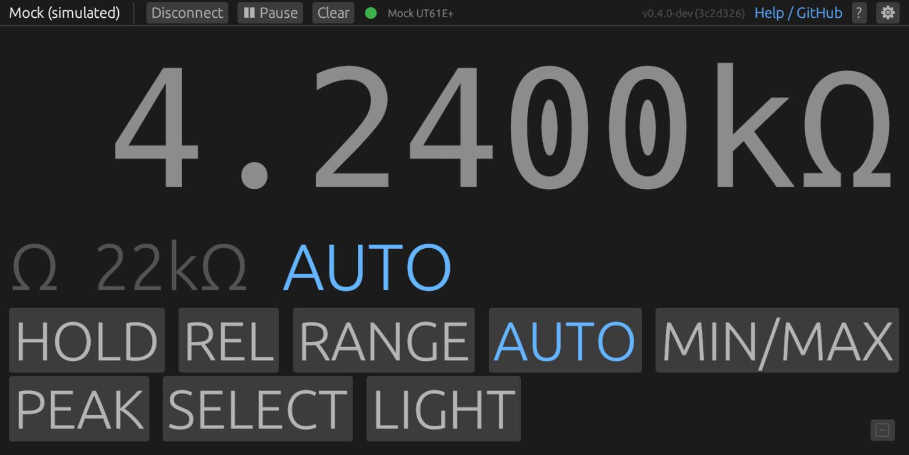

# ut61eplus-gui — GUI Reference

<!-- Keep this file in sync with the GUI. If you add, remove, or change
     features, panels, or controls, update the relevant section here in the
     same commit. -->

## Name

**ut61eplus-gui** — real-time graphing multimeter display for the UNI-T UT61E+

## Synopsis

```
ut61eplus-gui
```

## Description

A desktop GUI for live measurement display, time-series graphing, recording,
and remote control of the UNI-T UT61E+ multimeter. Built with egui/eframe.

The Settings panel includes a **Device** selector with all supported
models (UT61E+, UT61B+, UT61D+, UT161B/D/E, UT8803, UT171A/B/C,
UT181A) and a **Mock (simulated)** option. The selection persists across
sessions and requires a reconnect to take effect. When connected to an
experimental (unverified) protocol, an orange **EXPERIMENTAL** badge
appears in the top bar.

The **Mock (simulated)** device generates synthetic measurements without
hardware, cycling through DC V, AC V, Ohms, Capacitance, Hz,
Temperature, DC mA, Overload, and NCV modes. When Mock is selected, a
**Mock mode** row appears in Settings with choices: **Auto (cycle)**
(default) or a specific mode (dcv, acv, ohm, cap, hz, temp, dcma,
ohm-ol, ncv). Selecting a specific mode pins the mock to that
measurement type indefinitely. Remote control buttons (HOLD, REL,
RANGE, etc.) respond to toggle flags. The SELECT button advances to
the next mode regardless of the auto-cycle setting.


## Top Bar

The top bar contains:

- **App name and version**
- **Connect / Disconnect** button
- **Pause / Resume** button — freezes data capture without disconnecting.
  Pauses longer than the gap threshold produce gap markers on the graph.
- **Clear** button — resets graph history and statistics (does not affect
  recording)
- **Connection status** — colored dot (green = connected, orange =
  reconnecting/paused, gray = disconnected) with device name
- **Settings gear** (right side) — opens the settings panel
- **Help link** — opens the project page

Toast notifications appear in the top-right corner (e.g. CSV export
success/failure) and expire after 4 seconds.

## Reading Display


- Primary value in large monospace font, using the meter's raw 7-character
  display string for stable width (no jitter between readings)
- Unit shown adjacent (e.g. "V", "mV", "kΩ")
- Mode and range label below in smaller text
- Active flags shown as colored badges:
  - **AUTO** — auto-range active
  - **HOLD** — display frozen on meter
  - **REL** — relative/delta mode
  - **MIN**, **MAX** — min/max recording active
  - **LOW BAT** — low battery warning (orange)
- Overload ("OL") rendered in warning red

## Remote Control

A row of buttons shown when connected and receiving data (visible in the
[reading display screenshot above](#reading-display)):

| Button | Description |
|---|---|
| **HOLD** | Toggle hold mode |
| **REL** | Toggle relative mode |
| **RANGE** | Cycle manual range |
| **AUTO** | Return to auto-range |
| **MIN/MAX** | Enter/exit min/max recording |
| **PEAK** | Enter/exit peak min/max mode |
| **SELECT** | Cycle sub-modes |
| **LIGHT** | Toggle backlight |

Buttons highlight blue when the corresponding flag is active in the current
measurement. LIGHT has no protocol feedback, so it does not highlight.

## Graph


Three components stacked vertically: toolbar, main plot, and minimap.

### Toolbar

| Control | Description |
|---|---|
| **5s, 10s, 30s, 1m, 5m, 10m** | Time window presets |
| **LIVE** | Auto-scroll to latest data (green when active) |
| **Y:Auto / Y:Fixed** | Auto-scale Y axis, or enter fixed min/max values |
| **Mean** | Dashed horizontal line at visible window average, labeled with value |
| **Min/Max** | Sliding-window envelope band showing value range. Window duration is configurable (default 1s). |
| **Ref** | Horizontal reference lines at user-specified values (comma/semicolon/space separated) |
| **Triggers** | (requires Ref) Diamond markers where data crosses a reference line |
| **Cursors** | Click to place cursor A, click again for cursor B. Shows ΔT and ΔV. |

### Main Plot

- Time-series line plot with auto-scaling Y axis (10% padding)
- Axis labels include units (e.g. "1.0 mV", "10 s")
- Crosshair tooltip shows time and value with units
- Disconnection gaps shown as dashed red vertical line pairs
- Timeline is continuous across reconnects (data is not cleared)
- History buffer holds ~10,000 points (oldest dropped). Mode changes clear
  the graph since units are incompatible.

### Mouse Interactions

| Action | Effect |
|---|---|
| **Scroll wheel** (browse mode) | Zoom X axis centered on cursor (2s–3600s range) |
| **Scroll wheel** (live mode) | Exit live mode, jump to scrolled position |
| **Click & drag** | Pan left/right through history |
| **Double-click** | Return to live mode |
| **Click** (cursors active) | Place cursor A or B, snapping to nearest data point |

### Minimap

A thin strip below the main plot showing the full capture history.

- Bracket markers ([ ]) indicate the current viewport
- Click or drag to jump to a specific time
- Clicking near the end re-enables live mode

## Statistics

- **Min**, **Max**, **Avg** values in monospace with fixed-width formatting
- **Count** — number of samples
- **Reset** button — clears statistics
- Stats persist across reconnects (use Clear for full reset)
- In wide layout, a second row shows **visible window stats** — min/max/avg
  computed only over the current graph viewport

## Recording

- **Record (●) / Stop (■)** toggle button
- **Export CSV** button — opens a file save dialog (runs on a background
  thread, does not freeze the UI)
- Sample counter and duration shown while recording
- Scrollable log of the last 500 samples showing timestamp, value, unit, mode,
  range, and flags
- Buffer holds up to 500K samples (~14 hours at 10 Hz)

**CSV format:**

```
timestamp,mode,value,unit,range,flags
2026-03-19T10:15:30.123+01:00,DC V,3.3042,V,22V,AUTO
```

## Settings

Opened via the gear icon. Persisted to `~/.config/ut61eplus/settings.json`.

| Setting | Default | Description |
|---|---|---|
| **Theme** | Dark | Dark or Light mode |
| **Show Graph** | on | Toggle graph panel visibility |
| **Show Statistics** | on | Toggle statistics panel visibility |
| **Show Recording** | on | Toggle recording panel visibility |
| **Auto-connect** | on | Connect to meter automatically on startup |
| **Query device name** | on | Ask meter for its name on connect (causes a beep) |
| **Sample interval** | 0 ms | Delay between measurements: 0 (fastest, ~10 Hz), 100, 200, 300, 500, 1000, 2000 ms. Requires reconnect. |
| **Device** | UT61E+ | Device family. See the description for supported models and Mock. Requires reconnect. |
| **Mock mode** | Auto (cycle) | Only shown when Device is Mock. Pins the mock to a specific measurement mode, or cycles through all modes. Requires reconnect. |
| **Zoom** | 100% | UI scale (30%–300%). Also controllable via keyboard. |

## Keyboard Shortcuts

| Shortcut | Action |
|---|---|
| `Ctrl` + `+` / `=` | Zoom in |
| `Ctrl` + `-` | Zoom out |
| `Ctrl` + `0` | Reset zoom to 100% |

## Layout Modes

The layout adapts to the window size and panel visibility.

### Wide Layout (≥ 900px)

Two-column layout with a resizable left sidebar (180–400px):

- **Left column:** reading display, remote controls, connection help,
  statistics
- **Right column:** graph (top) and recording (bottom), separated by a
  draggable divider

### Narrow Layout (< 900px)

Single-column stack: reading, controls, help, statistics, graph, recording.

### Big Meter Mode



Activated when both graph and recording panels are hidden (via settings).
The reading display scales to fill the available space — useful as a
bench-mount display or for presentations.

## Connection Help

Shown automatically when connection fails:

- **USB adapter not found:** platform-specific instructions (Linux: udev rule
  install; Windows: CP2110 driver download)
- **No response from meter:** animated "Waiting for meter..." indicator
  during initial timeouts, then step-by-step instructions to enable USB mode
  (insert module, turn on, long-press USB/Hz until S icon appears)

Auto-reconnection retries every 2 seconds after a disconnect.

## Accessibility

- All colors are theme-aware — brighter variants on dark backgrounds, darker
  on light
- WCAG 2.1 AA contrast ratios: ≥4.5:1 for text, ≥3:1 for graphical elements
- Minimum font size 11pt throughout
- Flags use bold text in addition to color
- Status dot has a text label alongside the color indicator
- Graph overlays use distinct line styles (solid, dashed) in addition to color

## See Also

- [CLI reference](cli-reference.md) — command-line tool documentation
- [Setup guide](setup.md) — build prerequisites, udev rules, first-run
  instructions
- [UX design](ux-design.md) — design principles and layout rationale
