# dmm-gui — GUI Reference

<!-- Keep this file in sync with the GUI. If you add, remove, or change
     features, panels, or controls, update the relevant section here in the
     same commit. -->

## Name

**dmm-gui** — real-time graphing multimeter display for UNI-T and Voltcraft meters

## Synopsis

```
dmm-gui [OPTIONS]
```

## Description

A desktop GUI for live measurement display, time-series graphing, recording,
and remote control of UNI-T and Voltcraft multimeters.


## Connecting

The Settings panel includes a **Device** selector. **Auto-detect**, the
default, works out which meter is connected from its replies
([how](detection-design.md)), shows it in the top bar and saves it as the
**Device**; pick **Auto-detect** again after swapping meters. The probe makes
a UT61+/UT161 beep once.

The other choices are every supported model (see [supported
devices](supported-devices.md)), **Mock (simulated)**, which generates
synthetic measurements without hardware, and **Mock ZT-5B / V05B
(simulated)**, which simulates a ZOTEK meter ([what its keys
do](cli-reference.md#zotek-mock)); picking one skips detection. The
selection persists across sessions and requires a reconnect to take effect.
When the connected protocol is not fully verified, an orange
**EXPERIMENTAL** badge appears in the top bar; hovering it says how far the
meter is verified, and clicking it opens the device's verification issue on
GitHub, where you can report feedback.

Help is shown automatically when connection fails:

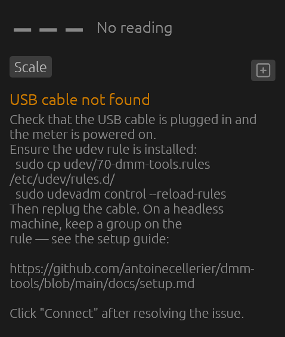

- **No meter found:** one section per link that was searched, each with its
  steps (Linux: udev rule install; Windows: Device Manager guidance to check
  if a driver is needed). All cable variants are detected automatically.
- **No response from meter:** animated "Waiting for meter..." indicator
  during initial timeouts, then what each meter needs switched on (insert
  module, turn on, long-press USB/Hz until S icon appears).

In big meter and minimal mode only the title is shown; hover it for the
steps.

Auto-reconnection retries every 2 seconds after a disconnect; over Bluetooth it
retries the same adapter. Click **Disconnect** (or press `Ctrl+O`) while it is
retrying to stop the loop, then **Connect** to look for another adapter.

## Top Bar

The top bar contains:

- **Device label** (left) — the model picked in Settings, or the one
  Auto-detect found; reads "Auto-detect" until a meter answers.
- **Connect / Disconnect** button
- **Pause / Resume** button — halts acquisition without disconnecting; the
  meter stops being polled entirely. Use the live-view toggle instead to
  freeze the view while data keeps arriving.
- **Clear** button — resets graph history and statistics (does not affect
  a recording)
- **Connection status** — colored dot (green = connected, orange =
  reconnecting/paused, gray = disconnected) with the device name and the link
  it is on: `UT61E+ · USB cable` or `UT61E+ · Bluetooth`. A window too narrow
  for the link drops it; hovering the status names it in full either way
- **Version** (right side) — click it to open the "What's New" changelog
  popup. On release upgrades, this popup opens automatically on first launch.
- **Help / GitHub** link — opens the project page
- **?** button — opens the [keyboard shortcuts](#keyboard-shortcuts) help
- **Settings gear** — opens the settings panel

Toast notifications (e.g. CSV export success/failure) appear in the
top-right corner in every layout and expire on their own.

## Reading Display


- Primary value in large monospace font, as the meter displays it
- Unit shown adjacent (e.g. "V", "mV", "kΩ")
- Sub-value rows under the reading for meters that send them (UT181A, UT171):
  label, value and unit, plus `@Ns` for the MIN/MAX timestamps. The narrow
  layout condenses them to one line.
- Mode and range label below in smaller text
- On meters that can switch function over USB (UT61+/UT161, UT181A, VC-880,
  VC650BT, VC-890, and the mock), the mode and range labels are dropdowns of
  what the meter offers from the current dial position, with the live entry
  marked `●`. Picking an entry switches the meter. Dial positions with a
  single mode, modes with a fixed range, and other meters keep the plain label.
- Active flags shown as colored badges, in this order:
  - **HV!** — high voltage warning (red)
  - **HOLD** — display frozen on meter
  - **REL** — relative/delta mode
  - **AUTO** — auto-range active
  - **MIN**, **MAX**, **AVG** — min/max/average recording active
  - **LOW BAT** — low battery warning (orange)
  - **P-MAX**, **P-MIN** — peak max/min capture active
  - **LEAD ERR** — lead error (orange)
  - **COMP**, **REC**, **LoZ** — compare mode, the meter's own recording,
    low-impedance voltage input
  - **VOID** — reading marked invalid by the meter (orange)
  - **SCALE** — a software [scale](#scale) is applied to the reading
- Overload ("OL") rendered in warning red

## Remote Control

A row of buttons shown when connected and receiving data (visible in the
[reading display screenshot above](#reading-display)):

| Button | Description |
|---|---|
| **HOLD** | Toggle hold mode |
| **REL** | Toggle relative mode |
| **RANGE** | Press RANGE on the meter: one step through the manual ranges. To jump to a range, use the range dropdown under the reading. |
| **AUTO** | Return to auto-range |
| **MIN/MAX** | Click to enter or cycle MAX ↔ MIN. Shows stored value. **x** exits. |
| **PEAK** | Click to enter or cycle P-MAX ↔ P-MIN. Shows stored peak. **x** exits. |
| **SELECT** | Cycle sub-modes |
| **LIGHT** | Toggle backlight |

Buttons highlight blue when the corresponding flag is active in the current
measurement. LIGHT has no protocol feedback, so it does not highlight. On the
mock, the buttons respond to toggle flags and SELECT, or a pick in the mode
dropdown, moves to the next scenario.

## Graph


Three components stacked vertically: toolbar, main plot, and minimap.

### Toolbar

| Control | Description |
|---|---|
| **5s, 10s, 30s, 1m, 5m, 10m** | Time window presets |
| **LIVE** | Auto-scroll to latest data (filled when active) |
| **Y:Auto / Y:Fixed** | Auto-scale Y axis, or enter fixed min/max values |
| **Reset Zoom** | Return to live follow with auto Y (enabled when the view has been zoomed or paused) |
| **Plot:** | Choose which series the graph draws: **Main** (the meter's reading) or a sub-value the meter is sending. Shown for meters that send sub-values (UT181A, UT171) and while a software [scale](#scale) is active, which adds **Raw**. Switching restarts the graph; if the meter stops sending the chosen sub-value, the graph returns to **Main**. |
| **Show:** | One chip per sub-value in the plotted series' unit: click to draw or hide its trace beside the plotted series. Hidden traces are still recorded. Session-only. |
| **Mean** | Dashed horizontal line at visible window average, labeled with value |
| **Min/Max** | Sliding-window envelope band showing value range. Window duration is configurable (default 1s). |
| **Ref** | Horizontal reference lines at user-specified values (comma/semicolon/space separated) |
| **Triggers** | (requires Ref) Diamond markers where data crosses a reference line |
| **Cursors** | Click to place cursor A, click again for cursor B. Shows ΔT, ΔV, and ∫ (integral, for current/voltage modes only). |

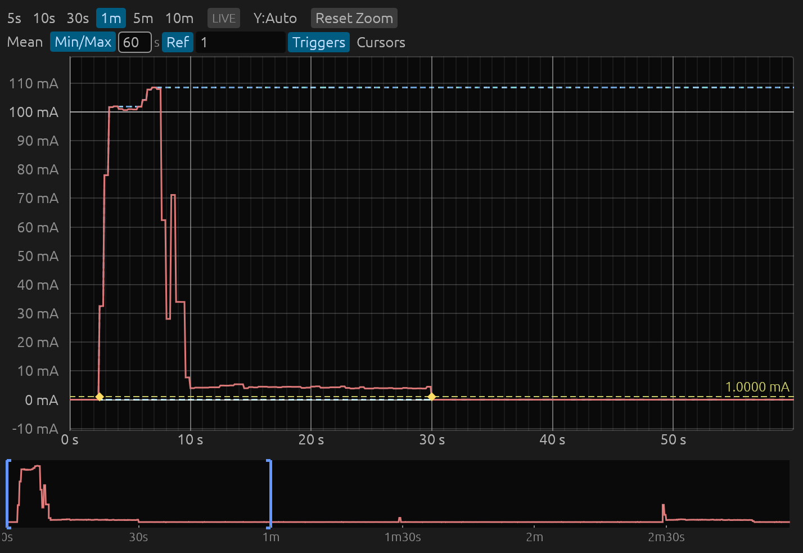

### Main Plot

- Time-series line plot with auto-scaling Y axis
- Axis labels include units (e.g. "1.0 mV", "10 s")
- Crosshair tooltip shows time and value with units, and names the series it
  is over when several are drawn
- No-data gaps (disconnect, pause, slow sample interval) shown as dashed
  vertical line pairs
- Overloads shown as a filled band in the error colour, drawn at their true
  duration; the crosshair reports `overload` inside one
- Timeline is continuous across reconnects (data is not cleared)
- History buffer holds up to the configured [buffer size](#settings) (oldest
  dropped). A change of mode, unit or plotted series clears the graph —
  including auto-range crossing a decade (Ω→kΩ)
- Sub-values in the plotted series' unit are drawn beside it as dashed or
  dotted lines, named in a key in the plot's top-left corner; the toolbar's
  **Show:** chips pick which. Sub-values in another unit are reached through
  **Plot:** instead
- The minimap, the cursors, the Mean/Min/Max/Ref overlays and the
  visible-window statistics follow the plotted series

Two cases the graph does not draw faithfully: a connection loss entirely
inside a continuing overload is absorbed into the band instead of splitting
it, and several dropouts between the same two readings collapse into one gap.

### Mouse Interactions

| Action | Effect |
|---|---|
| **Ctrl + scroll wheel** (or pinch) | Zoom X axis centered on cursor (2s–3600s range); leaves live mode |
| **Scroll wheel** | Scrolls the panel — the graph ignores it |
| **Click & drag** | Pan left/right through history |
| **Shift + click & drag** | Draw a bounding box to zoom both time and value to the selected region. Release to apply; press Escape to cancel. |
| **Double-click** | Return to live mode with auto Y |
| **Click** (cursors active) | Place cursor A or B, snapping to nearest data point |

### Minimap

A thin strip below the main plot showing the full capture history.

- Bracket markers ([ ]) indicate the current viewport
- Overload bands mirror the main plot, widened to a pixel when narrower
- Spikes stay visible however long the session runs
- Click or drag the interior to jump to a specific time
- Drag the bracket edges to resize the viewport to an arbitrary time width
- Clicking near the end re-enables live mode

## Statistics

- **Min**, **Max**, **Avg** values in monospace with fixed-width formatting
- **Count** — number of samples
- **Int** — cumulative time-integral (shown only for current and voltage modes).
  For current modes, displays charge in Ah/mAh/µAh. For voltage modes, V·s.
  Resets with the Reset button.
- **Reset** button — clears statistics and integral
- Stats persist across reconnects (use Clear for full reset)
- In wide layout, a second row shows **visible window stats** — min/max/avg
  computed only over the current graph viewport
- Min/Max/Avg/Count/∫ track the meter's main reading whatever the graph is
  plotting; the visible-window row follows the plotted series and is
  captioned with its unit
- With a software [scale](#scale) active, all of these follow the scaled
  reading, and ∫ its unit: a clamp relabelled to `A` gives charge in Ah

## Recording

- **Record (●) / Stop (■)** toggle button — starting clears the buffer,
  asking first if a recording holds samples you haven't exported
- **Export…** button — saves the recording as a CSV, named after the meter,
  the mode it stayed in and the recording's start time; with nothing
  recorded, it saves the readings the graph holds. The arrow beside it
  offers JSON instead, or a replay file that
  [`--replay`](#command-line-options) plays back
- **Discard** button — drops a stopped recording, asking first if it holds
  samples you haven't exported; Export… then saves the graph's readings again
- Sample counter and duration shown while recording
- Scrollable log of the last 500 samples showing timestamp, value, unit, flags
  and any sub-values
- Buffer holds up to the configured [buffer size](#settings). Recording
  auto-stops when the buffer is full and shows a toast notification.

**CSV format:**

```
# device: UT61E+
timestamp,mode,value,unit,range,flags
2026-03-19T10:15:30.123+01:00,DC V,3.3042,V,22V,AUTO
```

Meters that report sub-values add `auxN_label,auxN_value,auxN_unit` columns,
and a software [scale](#scale) adds one more such group holding the meter's
own **Raw** reading. The column layout is the same as `dmm-cli read`'s and
is described in the [CLI reference](cli-reference.md#dmm-cli-read), as is the
JSON export's one-object-per-line shape.

## Specifications

Shows per-range electrical specifications from the device manual, updated live
as the meter changes mode/range.

- **Resolution** — smallest increment the meter can display in the current range
- **Accuracy** — rated accuracy as ±(% of reading + counts). AC modes show
  separate accuracy for each frequency band (e.g., 40Hz–1kHz and 1kHz–10kHz).
  Temperature shows accuracy per sub-range (e.g., -40–0°C, 0–300°C).
- **Input Z** — input impedance (e.g., About 10MΩ), when applicable
- **Notes** — additional info like "True RMS", accuracy conditions or thermocouple type
- **Manual** — hyperlink to the manufacturer's product page (shown whenever a
  URL is configured for the device, even without per-range spec data)

The **Specifications** checkbox in [Settings](#settings) shows the panel,
and the checkboxes after it pick its fields. Clicking the **Specifications**
heading folds the wide panel to the narrow layout's line and back; the fold
persists across restarts. Default: unfolded.

**Layout behavior:**

| Layout | Display style |
|---|---|
| Wide (≥ 900px) | Full panel in the left sidebar, between controls and statistics |
| Big meter | Pipe-separated inline summary, scaled with the reading |
| Narrow (< 900px) | Compact single line below the reading |

The one-line layouts (big meter, narrow, folded) show Resolution and
Accuracy only. A reading the manual gives no range row for shows its mode's
Input Z and notes in the full panel. When no spec data is available
(unsupported device or unrecognized mode), only the Manual link is shown (if
configured). If neither specs nor manual URL exist, nothing renders.

**Coverage:** UT61E+, UT61B+, UT61D+, UT161B/D/E, UT181A, UT803, UT804, and
Mock (the UT61E+'s figures; none in its temperature modes). Other devices
show only the Manual link.

## Scale

**Scale**, next to the remote controls, applies a software transform to the
reading — a current clamp's 10 mV/A, a shunt, a probe divider, °C to °F.
Nothing is sent to the meter. Clicking it opens three fields:

| Field | Meaning | Left empty |
|---|---|---|
| **×** (Scale factor) | multiply the reading by this | ×1 |
| **+** (Offset) | add this afterwards | +0 |
| **→** (Unit label) | show this unit instead of the base unit | no relabel |

**Apply**, or Enter in a field, commits; **Off** turns scaling off.

The reading is converted to its base unit (V, A, Ω, …) before scaling, so a
factor survives auto-ranging: a 10 mV/A clamp is `× 100 → A`. With no unit
label the reading shows in the base unit.

The meter's own reading is kept as a **Raw** sub-value in the reading
display, the graph's **Plot:** and **Show:** groups, the recording log and
the CSV export; its **Show:** trace starts hidden. Sub-values in the same
unit as the reading (a second thermocouple, a REL reference, MIN/MAX) are
scaled with it; sub-values in another unit are left as sent. Statistics and
the integral use the scaled reading.

Applying or clearing a scale resets the graph and statistics, like
**Clear**; a recording in progress continues with scaled values. The setting
is session-only and survives disconnect and `Ctrl+L`. `dmm-cli read` offers
the same transform as `--scale`, `--offset` and `--unit`.

## Layout Modes

The layout adapts to the window size and panel visibility. In a window too
small for its content, the panels scroll rather than being cut off, and the
top bar stays in place. The mouse wheel scrolls; `Ctrl` + wheel zooms the
graph.

### Wide Layout (≥ 900px)

Two-column layout with a resizable left sidebar (180–400px):

- **Left column:** reading display, remote controls, connection help,
  specifications, statistics
- **Right column:** graph (top) and recording (bottom), separated by a
  draggable divider

### Narrow Layout (< 900px)

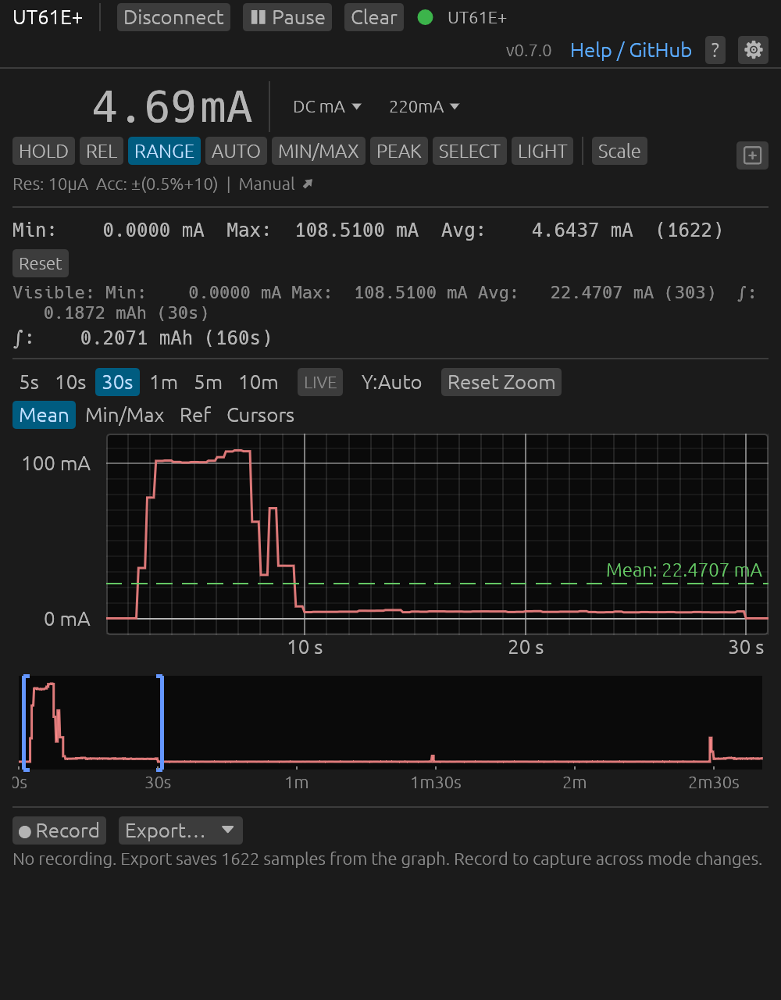

Single-column stack: reading, controls, help, specifications (compact),
statistics, graph, recording.

### Big Meter Mode


Activated when both graph and recording panels are hidden (via settings
or the toggle). The reading display scales to fill the available space —
useful as a bench-mount display or for presentations.

Use the **⊞** button (near the remote control buttons) or **Ctrl+B** to
quickly enter big meter mode — this temporarily hides graph, recording,
statistics, and specifications without changing your saved settings.
Press **Ctrl+B** again to enter **minimal mode**, which also hides the
top bar and command buttons, leaving only the reading and mode line.
Press **Ctrl+B** a third time to return to your normal layout. In a window
too small to show the **⊞** button, **Ctrl+B** is the way out.

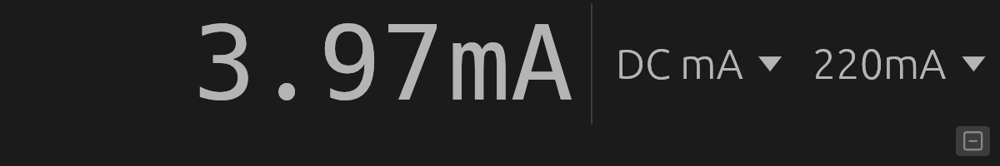

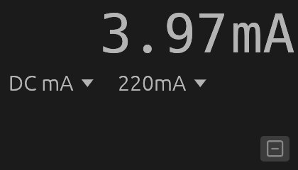

If all panels are already hidden via settings, **⊞** restores all panels
to their defaults.

## Settings

Opened via the gear icon. Persisted to `~/.config/dmm-tools/settings.json` on Linux (XDG config dir under the `dmm-tools` project name; macOS and Windows use the equivalent platform-specific location).

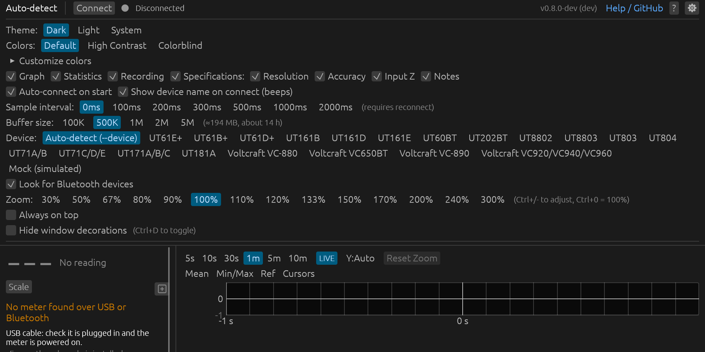

| Setting | Default | Description |
|---|---|---|
| **Theme** | Dark | Dark, Light, or System (follows the desktop's light/dark setting, falling back to Dark if it reports none) |
| **Colors** | Default | Color preset: Default, High Contrast, Colorblind. See [Color Customization](#color-customization) below. |
| **Graph** | on | Toggle graph panel visibility |
| **Statistics** | on | Toggle statistics panel visibility |
| **Recording** | on | Toggle recording panel visibility |
| **Specifications** | on | Toggle [specifications](#specifications) panel visibility |
| **Resolution**, **Accuracy**, **Input Z**, **Notes** | on | Shown while **Specifications** is on. Each shows or hides its field in the specifications. |
| **Auto-connect on start** | on | Connect to meter automatically on startup |
| **Show device name on connect (beeps)** | on | Ask meter for its name on connect. Skipped when Auto-detect already has the name. |
| **Sample interval** | 0 ms | Delay between measurements: 0 (as fast as the link delivers: on a UT61E+, about 10 a second over USB, 3 over Bluetooth), 100, 200, 300, 500, 1000, 2000 ms. Requires reconnect. |
| **Buffer size** | 500K | Samples kept by the graph and for export alike: 100K, 500K, 1M, 2M, 5M. Applies immediately; lowering it drops the oldest points and stops a recording already past the new size. Hover shows the memory and hours each size buys. `settings.json` accepts any size from 1K to 50M. |
| **Device** | Auto-detect | Auto-detect finds the meter and saves it here; the other chips pick a model directly. Requires reconnect. |
| **Look for Bluetooth devices** | on | When off, nothing scans for adapters or meters and the connection help offers no Bluetooth steps. An address given to `--adapter` is still opened. Takes effect on the next connect. |
| **Mock mode** | Auto (cycle) | Only shown when Device is Mock. Pins the mock to one of the scenarios listed under [Command-Line Options](#command-line-options), or cycles through all of them. Requires reconnect. |
| **Zoom** | 100% | UI scale (30%–300%). Also controllable via keyboard. |
| **Always on top** | off | Keep the window above all other windows (`Ctrl+T`). Not available on Wayland (greyed out): right-click the title bar and use the window menu instead. |
| **Hide window decorations** | off | Remove the title bar and window borders (`Ctrl+D`). Use Alt+drag (Linux) or the keyboard shortcut to restore. |

### Color Customization

**Presets.** The **Colors** row picks the palette. Switching presets resets
any per-color overrides.

| Preset | Palette |
|---|---|
| **Default** | warm — red/pink graph line, green mean, orange cursors |
| **High Contrast** | bolder, higher-saturation colors |
| **Colorblind** | deuteranopia/protanopia safe — blue/orange/purple, avoids red-green |

| | |
|---|---|
| 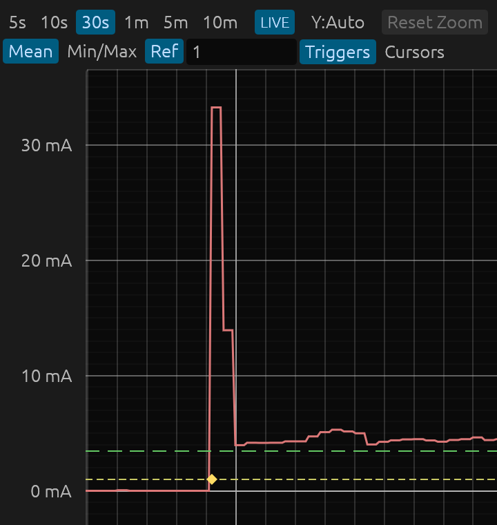 | 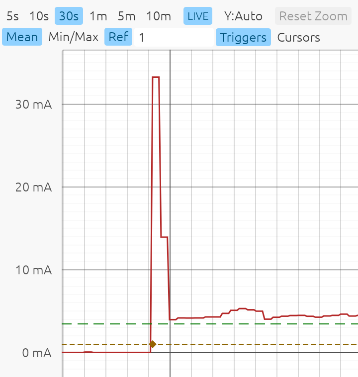 |
| 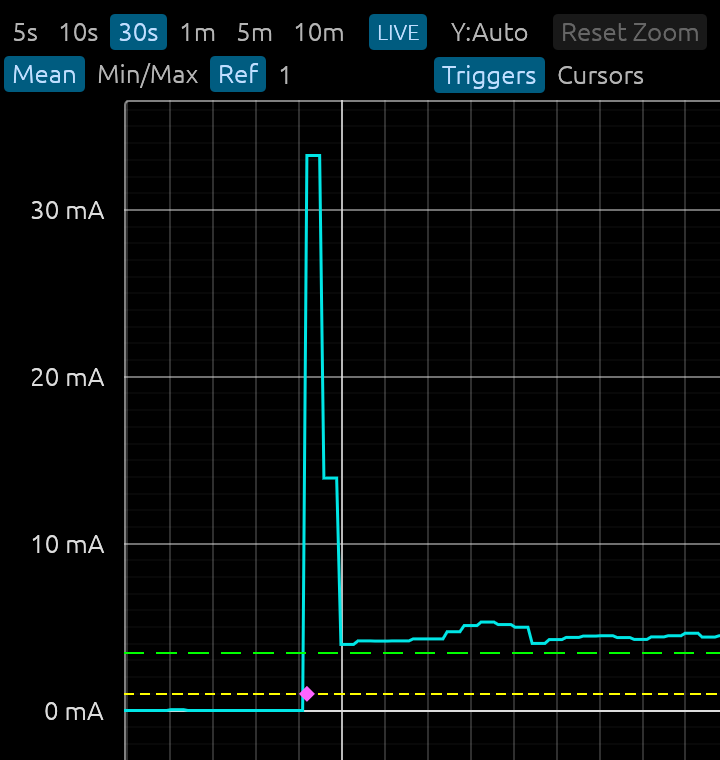 | 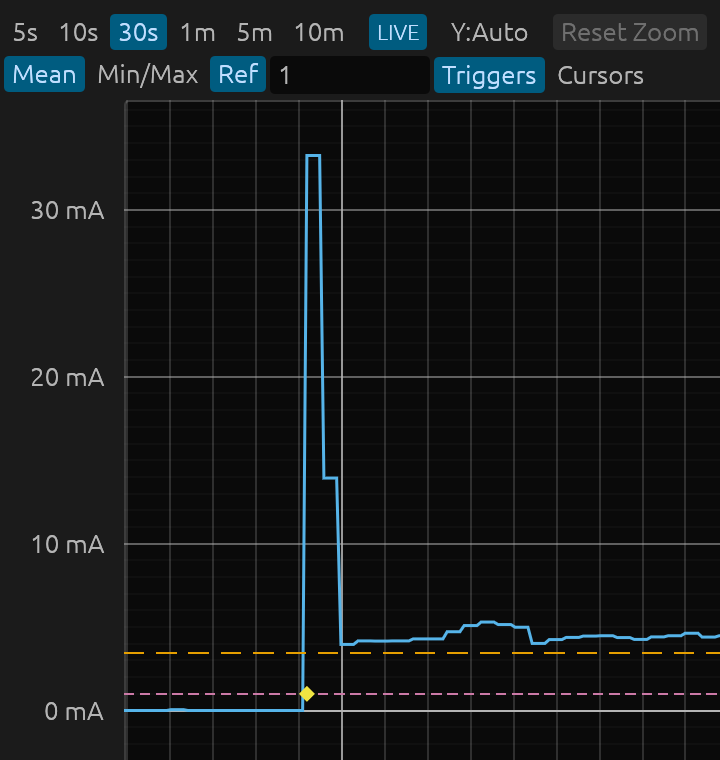 |

**Per-color editing.** Expand **Customize colors** for a swatch per color,
grouped UI, Graph, Status and Minimap; click one to open a picker. The
swatches edit the theme mode you are in; dark and light each keep their own
colors. The same colors can be set in `settings.json` — see [Color
fields](#color-fields) in the appendix.

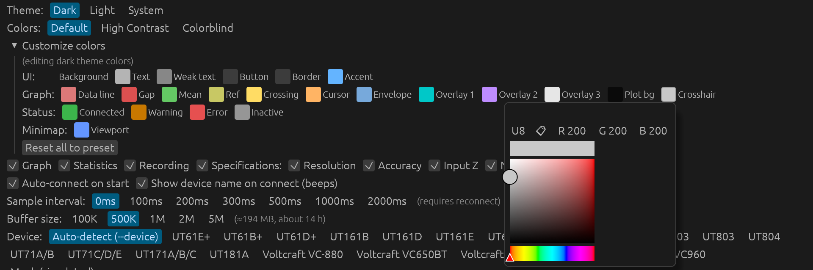

## Keyboard Shortcuts

Press `?` or `F1`, or click the `?` button in the top bar, to open an in-app reference of keyboard shortcuts and mouse gestures.

### General

On macOS, `Cmd` replaces `Ctrl` in the shortcuts below, and the in-app help
shows the macOS spelling.

| Shortcut | Action |
|---|---|
| `Ctrl+O` | Connect / Disconnect |
| `Space` | Pause / Resume (when connected) |
| `Ctrl+L` | Clear graph & statistics |
| `Ctrl+R` | Toggle recording |
| `Ctrl+B` | Cycle big meter mode (off / full / minimal) |
| `Ctrl+T` | Toggle always on top (not available on Wayland — right-click the title bar instead) |
| `Ctrl+D` | Toggle window decorations |
| `Ctrl+E` | Export CSV… |
| `F11` (`Ctrl+Cmd+F` on macOS) | Toggle fullscreen |
| `Cmd+M` (macOS) | Minimise window |
| `Ctrl+Plus` / `Ctrl+Minus` | Zoom in / out |
| `Ctrl+0` | Reset zoom to 100% |
| `Ctrl+Q` | Quit |
| `Ctrl+W` | Close the help overlay, or quit when it is closed |
| `?` / `F1` | Toggle keyboard & mouse help overlay |
| `Esc` | Close help overlay |

### Graph

| Shortcut | Action |
|---|---|
| `[` / `]` | Cycle to shorter / longer time window preset |
| `Left` / `Right` | Scroll view (exits live mode) |
| `Home` | Jump to start of data |
| `End` | Jump to live mode |
| `M` | Toggle the mean line |
| `X` | Toggle the min/max band |
| `R` | Toggle reference lines, and put the caret in the values field |
| `T` | Toggle trigger markers (needs reference lines on) |
| `C` | Toggle cursors |

Graph and `Space` shortcuts are disabled while any widget holds keyboard
focus — not just text fields but any button reached with `Tab`, since `Space`
and the arrow keys drive the focused widget. Press `Escape` to release it.

## Command-Line Options

All options override saved settings for the current session only — they
do not modify the persisted `settings.json`.

| Option | Description |
|--------|-------------|
| `--device <ID>` | Meter model to connect to (e.g., `ut61eplus`, `ut181a`, `mock`), or `auto` (default). `--help` lists them. |
| `--adapter <SERIAL_PATH_OR_ADDRESS>` | Select a specific adapter when more than one is reachable. Use the serial number or HID path of a USB cable, or the address of a Bluetooth adapter, from `dmm-cli list` output. |
| `--no-bluetooth` | Turn off Bluetooth scanning for this session, whatever **Look for Bluetooth devices** is set to. |
| `--mock-mode <MODE>` | Pin mock device to a specific mode (only with `--device mock`). Modes: dcv, acv, ohm, cap, hz, temp, dcma, ohm-ol, ncv, acv-hz, temp2, temp-diff, temp-diff-rev, noise. |
| `--replay <FILE>` | Play back a replay file — saved by [Export…](#recording) or `dmm-cli read --format replay` — instead of connecting to a meter. |
| `--theme <THEME>` | Theme override: `dark`, `light`, or `system`. |
| `--renderer <RENDERER>` | Graphics renderer: `wgpu` (default) or `glow` (OpenGL, better compatibility on older GPUs). If wgpu fails at startup, glow is tried automatically. |
| `-V`, `--version` | Print version and exit. |
| `-h`, `--help` | Print help and exit. |

When started from a terminal, dmm-gui logs there as [dmm-cli](cli-reference.md#environment-variables) does, with `RUST_LOG` setting the filter.

## Accessibility

### Visual

- Theme-aware colors with WCAG 2.1 AA contrast ratios (≥4.5:1 text, ≥3:1 graphical elements). Minimum 11 pt font; status flags use bold text in addition to color so they don't rely on color alone.
- Secondary text (the mode line under the reading, sub-value labels, toolbar and hint captions) has its own per-preset color that meets the same 4.5:1 bar as the primary text.
- Every button, link, toggle, and setting has a hover tooltip explaining what it does — hover any control to learn it without leaving the GUI.

### Keyboard

- Every feature is reachable from the keyboard. See [Keyboard Shortcuts](#keyboard-shortcuts) for the full list.
- Tab and Shift+Tab cycle through every control in visual order, with a visible focus outline.
- Custom widgets respond to arrow keys when focused: **Left/Right** pans the graph minimap, **Up/Down** resizes the recording-panel divider, and **Left/Right** resizes the left side-panel handle. Inside the Customize colors popup, the saturation/value square and the hue gradient also accept arrow keys.
- The mode and range dropdowns under the reading open on Enter or Space; Up/Down move, Enter picks, Esc or Tab closes.
- Text inputs (Y axis min/max, envelope window seconds, reference values) carry hint text that screen readers announce as the field name.
- The `?` help overlay and the **What's New** window keep focus inside while open and return it to the control that opened them when closed.

### Screen reader

Screen reader support is built on [AccessKit](https://accesskit.dev/) and exposed through each platform's native accessibility API: AT-SPI on Linux (used by [Orca](https://orca.gnome.org/)), UI Automation on Windows, and NSAccessibility on macOS. The labels described below are wired up in the code but have **not yet been walked end-to-end with a real screen reader** — verification is [tracked as an open item](verification-backlog.md). Reports of what does and doesn't come through as expected are welcome.

- Every button, toggle, text field, and custom widget has a spoken name; icon-only buttons, color swatches, the graph minimap and the resize bars announce what they do instead of their glyph or color.
- Toggle buttons like HOLD, REL, RANGE, AUTO, MIN/MAX, PEAK, the graph's LIVE button and **Scale** announce whether they are currently on or off — you don't have to rely on the color change.
- The graph toolbar's **Plot:** chips announce as "Plot \<name\>" radio buttons and its **Show:** chips as "Show \<name\> trace" toggles.
- The main reading updates as a polite live region: new values are spoken at natural pauses, not interrupting you. Sub-values are spoken after the mode, MIN/MAX timestamps included. Active status flags (HOLD, REL, MIN, MAX, AUTO, ...) are spoken alongside the value so toggling them via the on-device buttons gives audible confirmation. A reading passed through a software [scale](#scale) ends with ", software scaled".
- The graph announces a one-line summary of what it's showing: which series is plotted, time window, Y-axis range, number of samples, the sub-value traces drawn beside it, whether it's following live, and the most recent reading (using the same digit string the sighted user sees) — or that the meter is currently over range. The summary updates whenever any of those change.
- The top bar, main content area, and connection status region are exposed as Toolbar, Main, and Status landmarks for flat-review navigation (e.g. Orca+Ctrl+Shift+L on Linux).

### Known limitations

- There is no per-sample keyboard navigation inside the graph — you can't step from one data point to the next and hear each value spoken. Use the Statistics panel for min/max/average and the Recording panel's sample list for point-level readings; the sample list is a scrollable text log that screen readers read row by row.
- Graph measurement cursors (A/B) can only be placed by clicking on the plot.
- In the **Customize colors** popup, the RGBA fields need Enter to enter edit mode, then Up/Down to change the value; mouse drag remains the fastest way to pick a color.
- The graph plot's X and Y axes are separate Tab stops that don't show a focus ring.

## Appendix

### Color fields

Colors can be edited directly in `settings.json` using hex strings
(`#RRGGBB` or `#RRGGBBAA`), per theme mode:

```json
{
  "color_preset": "Default",
  "color_overrides": {
    "dark": {
      "background": "#1B1B1B",
      "graph_line": "#64C8FF"
    },
    "light": {
      "graph_line": "#0050A0"
    }
  }
}
```

Available color fields:

- **UI chrome:** `background`, `text`, `weak_text`, `button`, `border`, `accent`
- **Graph:** `graph_line`, `graph_gap`, `graph_mean`, `graph_ref`, `graph_crossing`, `graph_cursor`, `graph_envelope`, `graph_overlay_1`, `graph_overlay_2`, `graph_overlay_3`, `plot_background`, `graph_crosshair`
- **Status:** `status_ok`, `status_warning`, `status_error`, `status_inactive`
- **Minimap:** `minimap_viewport`

Derived colors auto-track their base: cursor dim/delta from `graph_cursor`, minimap line from `graph_line`, recording warning from `status_warning`, button hover/active from `button`, plot grid and axis labels from `text`. `text` also governs button captions and headings, and `accent` selected toggles and chips, focus rings and selected text; left unset, both keep egui's defaults. `border` is set only by the High Contrast preset.

## See Also

- [CLI reference](cli-reference.md) — command-line tool documentation
- [Setup guide](setup.md) — build prerequisites, udev rules, first-run
  instructions
- [Supported devices](supported-devices.md) — full compatibility list and device families
