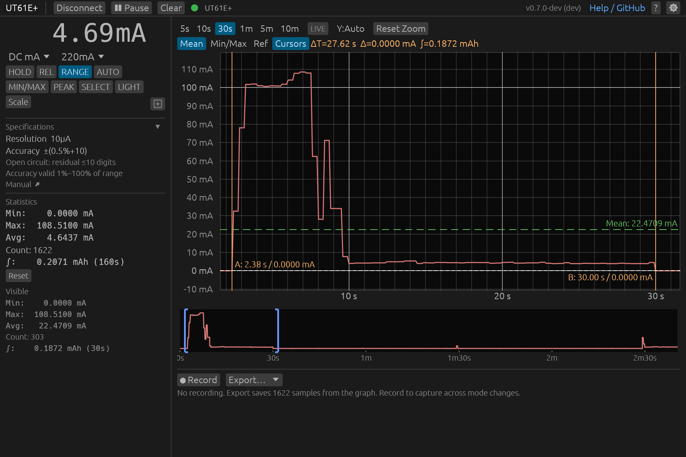
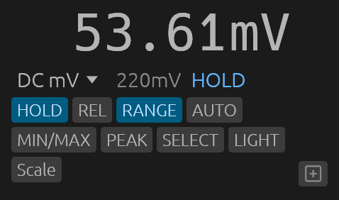
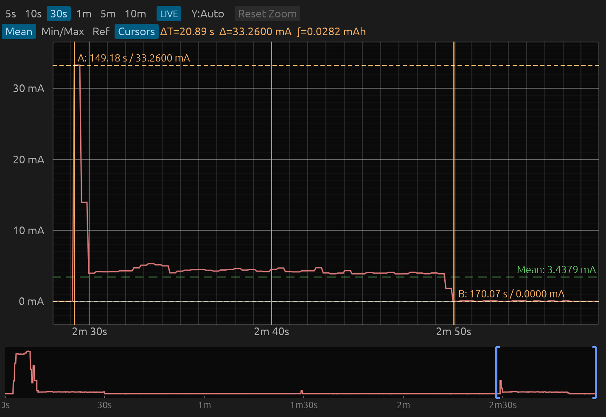
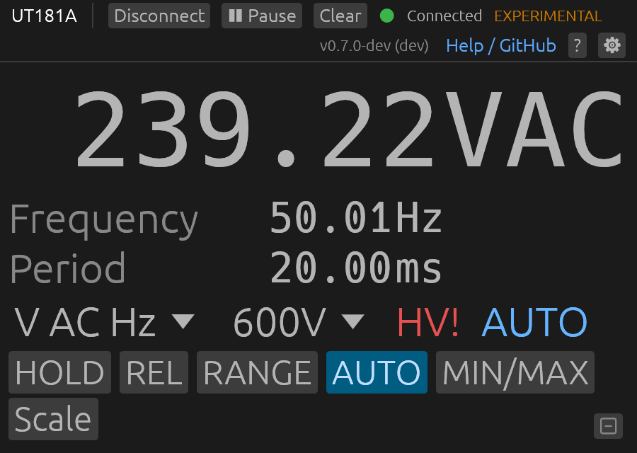

# dmm-gui — GUI Reference

<!-- Keep this file in sync with the GUI. If you add, remove, or change
     features, panels, or controls, update the relevant section here in the
     same commit. -->

## Name

**dmm-gui** — real-time graphing multimeter display for UNI-T and Voltcraft meters

## Synopsis

```
dmm-gui [OPTIONS]
```

## Description

A desktop GUI for live measurement display, time-series graphing, recording,
and remote control of UNI-T and Voltcraft multimeters.

The Settings panel includes a **Device** selector populated from the
device registry with all supported models (UT61E+, UT61B+, UT61D+,
UT161B/D/E, UT8802, UT8803, UT803, UT804, UT171A/B/C, UT181A,
Voltcraft VC-880, Voltcraft VC650BT, Voltcraft VC-890) and a **Mock (simulated)**
option. Each model selects the correct protocol tables (e.g., UT61B+
uses different mode/range mappings than UT61E+). The selection persists
across sessions and requires a reconnect to take effect. When connected
to an experimental (not yet fully verified) protocol, an orange **EXPERIMENTAL**
badge appears in the top bar. Clicking it opens the device's
verification issue on GitHub where you can report feedback.

The **Mock (simulated)** device generates synthetic measurements without
hardware, cycling through DC V, AC V, Ohms, Capacitance, Hz,
Temperature, DC mA, Overload, NCV, and two multi-display modes (AC V
with frequency/period sub-readings, and dual-thermocouple temperature).
When Mock is selected, a **Mock mode** row appears in Settings with
choices: **Auto (cycle)** (default) or a specific mode (dcv, acv, ohm,
cap, hz, temp, dcma, ohm-ol, ncv, acv-hz, temp2). Selecting a specific
mode pins the mock to that measurement type indefinitely.
Remote control buttons (HOLD, REL,
RANGE, etc.) respond to toggle flags. The SELECT button advances to
the next mode regardless of the auto-cycle setting.



## Top Bar

The top bar contains:

- **App name and version** — click the version label to open the "What's
  New" changelog popup. On release upgrades, this popup opens automatically
  on first launch.
- **Connect / Disconnect** button
- **Pause / Resume** button — halts acquisition without disconnecting; the
  meter stops being polled entirely. Use the live-view toggle instead to
  freeze the view while data keeps arriving.
- **Clear** button — resets graph history and statistics (does not affect
  recording)
- **Connection status** — colored dot (green = connected, orange =
  reconnecting/paused, gray = disconnected) with device name
- **Settings gear** (right side) — opens the settings panel
- **Help link** — opens the project page

Toast notifications appear in the top-right corner (e.g. CSV export
success/failure) and expire after 4 seconds.

## Reading Display



- Primary value in large monospace font, using the meter's raw 7-character
  display string for stable width (no jitter between readings)
- Unit shown adjacent (e.g. "V", "mV", "kΩ")
- Sub-value rows under the reading for meters that send them (UT181A, UT171):
  one row per sub-value with its label, value and unit, plus `@Ns` for the
  MIN/MAX timestamps. Shown in every layout — the narrow layout condenses them
  to a single summary line. Single-display meters show nothing extra.
- Mode and range label below in smaller text
- Active flags shown as colored badges:
  - **AUTO** — auto-range active
  - **HOLD** — display frozen on meter
  - **REL** — relative/delta mode
  - **MIN**, **MAX** — min/max recording active
  - **LOW BAT** — low battery warning (orange)
  - **SCALE** — a software [scale](#scale) is applied to the reading. Unlike
    the others this is the app's own state, not something the meter reported,
    so it is drawn after the meter's badges
- Overload ("OL") rendered in warning red

## Remote Control

A row of buttons shown when connected and receiving data (visible in the
[reading display screenshot above](#reading-display)):

| Button | Description |
|---|---|
| **HOLD** | Toggle hold mode |
| **REL** | Toggle relative mode |
| **RANGE** | Cycle manual range |
| **AUTO** | Return to auto-range |
| **MIN/MAX** | Click to enter or cycle MAX ↔ MIN. Shows stored value. **x** exits. |
| **PEAK** | Click to enter or cycle P-MAX ↔ P-MIN. Shows stored peak. **x** exits. |
| **SELECT** | Cycle sub-modes |
| **LIGHT** | Toggle backlight |

Buttons highlight blue when the corresponding flag is active in the current
measurement. LIGHT has no protocol feedback, so it does not highlight.

## Scale

**Scale**, on its own row under the remote controls, applies a software
transform to the reading — a current clamp's 10 mV/A, a shunt, a probe
divider, °C to °F. It changes nothing on the meter, which is why it sits
apart from the buttons above it. Clicking it opens three fields:

| Field | Meaning | Left empty |
|---|---|---|
| **×** (Scale factor) | multiply the reading by this | ×1 |
| **+** (Offset) | add this afterwards | +0 |
| **→** (Unit label) | show this unit instead of the base unit | no relabel |

**Apply**, or Enter in a field, commits; nothing is applied while you type.
A zero or non-numeric value is rejected with a toast naming the field.
**Off** turns scaling off.

The arithmetic runs on the reading converted to its base SI unit (V, A, Ω,
F, Hz, S, W), so a factor survives auto-ranging: 123.4 mV and 0.1234 V are
the same input. A 10 mV/A clamp is therefore `× 100 → A`. With no unit
label the reading shows in the base unit (`× 10` on 123.4 mV gives 1.234 V).

The meter's own reading is kept as a **Raw** sub-value: in the reading
display, the graph's **Plot:**/**Show:** groups, the recording log and an
extra `auxN_*` CSV group. Its **Show:** chip starts unlit — the unscaled
reading is often a factor of a hundred away from the scaled one, and drawing
both would flatten the scaled trace against the shared Y axis — so click the
chip when you want the comparison. **Plot:** is unaffected: choosing **Raw**
there plots it as the main series.

Sub-values that measure the same quantity as the reading — a second
thermocouple, a REL reference, the MIN/MAX extremes — are scaled with it and
shown in the same unit, so they stay same-unit and keep overlaying the scaled
trace in the graph; sub-values in another unit, such as a frequency beside a
voltage, are left as the meter sent them.

Applying or clearing a scale resets the graph,
statistics and integral but not the recording buffer, like **Clear**; a
recording in progress continues with scaled values. The Specifications
panel keeps describing the meter's own range.

The setting is session-only — never written to `settings.json`, since a
stale factor silently corrupting a later session is worse than retyping it.
It survives disconnect, a device change and `Ctrl+L`. `dmm-cli read` takes
the same transform as `--scale`, `--offset` and `--unit`.

## Graph



Three components stacked vertically: toolbar, main plot, and minimap.

### Toolbar

Laid out in rows: the view controls (time window, LIVE, Y axis, Reset Zoom)
first, then — only for meters that send sub-values — a row of its own holding
the boxed **Plot:** and **Show:** groups, then the analysis overlays (Mean,
Min/Max, Ref, Cursors). A single-display meter shows only the first and last
rows, until a software [scale](#scale) is applied: its **Raw** sub-value
brings the **Plot:**/**Show:** row up for those meters too.

| Control | Description |
|---|---|
| **5s, 10s, 30s, 1m, 5m, 10m** | Time window presets |
| **LIVE** | Auto-scroll to latest data (green when active) |
| **Y:Auto / Y:Fixed** | Auto-scale Y axis, or enter fixed min/max values |
| **Reset Zoom** | Return to live follow with auto Y (enabled when the view has been zoomed or paused) |
| **Plot:** | Choose which series the graph draws: **Main** (the meter's reading) or any sub-value the meter is currently sending. Only appears for meters that send sub-values (UT181A, UT171), or while a software [scale](#scale) is active (which adds **Raw**). Switching restarts the graph, and so does the meter dropping the chosen sub-value for a few readings in a row — the graph returns to **Main**. |
| **Show:** | One chip per same-unit sub-value drawn beside the plotted series — click to draw or hide that trace. Only appears once there is such a sub-value — including the **Raw** reading a same-unit software [scale](#scale) adds, which is listed but starts hidden. Hiding one stops it being drawn (and drops it from the key and the Y-axis fit) but not recorded, so turning it back on brings its history with it. Session-only; survives `Ctrl+L` and a change of plotted series. |
| **Mean** | Dashed horizontal line at visible window average, labeled with value |
| **Min/Max** | Sliding-window envelope band showing value range. Window duration is configurable (default 1s). |
| **Ref** | Horizontal reference lines at user-specified values (comma/semicolon/space separated) |
| **Triggers** | (requires Ref) Diamond markers where data crosses a reference line |
| **Cursors** | Click to place cursor A, click again for cursor B. Shows ΔT, ΔV, and ∫ (integral, for current/voltage modes only). |

### Main Plot

- Time-series line plot with auto-scaling Y axis (10% padding)
- Axis labels include units (e.g. "1.0 mV", "10 s")
- Crosshair tooltip shows time and value with units
- No-data gaps (disconnect, pause, slow sample interval) shown as dashed
  vertical line pairs
- Overloads shown as a filled band in the error colour, drawn at their true
  duration; the crosshair reports `overload` inside one
- Timeline is continuous across reconnects (data is not cleared)
- History buffer holds ~10,000 points (oldest dropped). A change of mode or
  unit clears the graph — including auto-range crossing a decade (Ω→kΩ), and
  including a change of plotted series
- Sub-values sharing the plotted series' unit are drawn beside it as extra
  dashed/dotted lines, up to four. Selecting a sub-value adds the meter's main
  reading as one of them when the units match, so choosing T2 still shows T1.
  Sub-values in a *different* unit (the Hz and ms beside an AC voltage) are
  never overlaid — plotting them against the same axis would invent a
  relationship that isn't there; reach them through **Plot:** instead
- Whenever at least one such trace is drawn, a key in the plot's top-left
  corner names every line and shows its colour and dash pattern. The key is a
  key, not a control — use the toolbar's **Show:** chips to pick which
  sub-value traces are drawn
- The crosshair tooltip names the series it is over while overlays are shown
- The minimap, the measurement cursors, the Mean/Min/Max/Ref overlays and the
  visible-window statistics all follow the *plotted* series — the overlays are
  reference traces only

Two cases the graph does not draw faithfully: a connection loss entirely
inside a continuing overload is absorbed into the band instead of splitting
it, and several dropouts between the same two readings collapse into one gap.

### Mouse Interactions

| Action | Effect |
|---|---|
| **Scroll wheel** (browse mode) | Zoom X axis centered on cursor (2s–3600s range) |
| **Scroll wheel** (live mode) | Exit live mode, jump to scrolled position |
| **Click & drag** | Pan left/right through history |
| **Shift + click & drag** | Draw a bounding box to zoom both time and value to the selected region. Release to apply; press Escape to cancel. |
| **Double-click** | Return to live mode with auto Y |
| **Click** (cursors active) | Place cursor A or B, snapping to nearest data point |

### Minimap

A thin strip below the main plot showing the full capture history.

- Bracket markers ([ ]) indicate the current viewport
- Overload bands mirror the main plot, widened to a pixel when narrower
- Click or drag the interior to jump to a specific time
- Drag the bracket edges to resize the viewport to an arbitrary time width
- Clicking near the end re-enables live mode

## Specifications

Shows per-range electrical specifications from the device manual, updated live
as the meter changes mode/range. Helps users understand the precision and
limitations of their current reading.

- **Resolution** — smallest increment the meter can display in the current range
- **Accuracy** — rated accuracy as ±(% of reading + counts). AC modes show
  separate accuracy for each frequency band (e.g., 40Hz–1kHz and 1kHz–10kHz).
  Temperature shows accuracy per sub-range (e.g., -40–0°C, 0–300°C).
  LPF mode shows its own accuracy (separate from AC V).
- **Input Z** — input impedance (e.g., ~10 MΩ), when applicable
- **Notes** — additional info like "True RMS", thermocouple type, fuse ratings
- **Manual** — hyperlink to the manufacturer's product page (shown whenever a
  URL is configured for the device, even without per-range spec data)

Panel visibility is controlled by the **Specifications** checkbox in Settings.
Default: on.

**Layout behavior:**

| Layout | Display style |
|---|---|
| Wide (≥ 900px) | Full panel in the left sidebar, between controls and statistics |
| Big meter | Pipe-separated inline summary, scaled with the reading |
| Narrow (< 900px) | Compact single line below the reading |

When no spec data is available (unsupported device or unrecognized mode), only
the Manual link is shown (if configured). If neither specs nor manual URL exist,
nothing renders.

**Coverage:** UT61E+, UT61B+, UT61D+, UT161B/D/E, and Mock (delegates to
UT61E+). Other devices show only the Manual link.

## Statistics

- **Min**, **Max**, **Avg** values in monospace with fixed-width formatting
- **Count** — number of samples
- **Int** — cumulative time-integral (shown only for current and voltage modes).
  For current modes, displays charge in Ah/mAh/µAh. For voltage modes, V·s.
  Uses the trapezoidal rule over the sample stream. Resets with the Reset button.
- **Reset** button — clears statistics and integral
- Stats persist across reconnects (use Clear for full reset)
- In wide layout, a second row shows **visible window stats** — min/max/avg
  computed only over the current graph viewport
- Min/Max/Avg/Count/∫ track the meter's **main reading** whatever the graph is
  plotting; the visible-window row follows the **plotted series** and is
  captioned with its unit, so selecting a Hz sub-value shows Hz there and V in
  the session block above
- With a software [scale](#scale) active, all of these follow the *scaled*
  reading, and ∫ follows its unit — a clamp relabelled to `A` gives charge in
  Ah where the unscaled millivolts would have given V·s

## Recording

- **Record (●) / Stop (■)** toggle button — starting clears the buffer, so
  it asks first if the buffer holds samples you haven't exported
- **Export CSV** button — opens a file save dialog (runs on a background
  thread, does not freeze the UI)
- Sample counter and duration shown while recording
- Scrollable log of the last 500 samples showing timestamp, value, unit, flags
  and any sub-values
- Buffer holds up to 500K samples (~14 hours at 10 Hz). Recording
  auto-stops when the buffer is full and shows a toast notification.

**CSV format:**

```
# device: UT61E+
timestamp,mode,value,unit,range,flags
2026-03-19T10:15:30.123+01:00,DC V,3.3042,V,22V,AUTO
```

Meters that report sub-values add one `auxN_label,auxN_value,auxN_unit` group
per slot the family can send (UT181A 4, UT171 1, mock 2), padded with empty
fields when a reading uses fewer. Single-display meters keep the six-column
file above.

```
# device: UNI-T UT181A
timestamp,mode,value,unit,range,flags,aux1_label,aux1_value,aux1_unit,aux2_label,aux2_value,aux2_unit,aux3_label,aux3_value,aux3_unit,aux4_label,aux4_value,aux4_unit
2026-09-02T09:33:56.123+02:00,V AC Hz,239.22,VAC,600V,AUTO HV!,Frequency,50.01,Hz,Period,20.00,ms,,,,,,
```

A software [scale](#scale) claims one more slot for its **Raw** group, so a
single-display meter recorded with a scale on gets `aux1_label,aux1_value,
aux1_unit` holding the meter's own reading. The **Raw** group is always the
last one in the file, so it keeps the same columns even as the meter's own
sub-value count changes with the mode. Turning a scale on after Record has
started still gets the column, and the rows recorded before it simply leave
that group empty; turning one off mid-recording leaves it empty for the rest
of the file.

## Settings

Opened via the gear icon. Persisted to `~/.config/dmm-tools/settings.json` on Linux (XDG config dir under the `dmm-tools` project name; macOS and Windows use the equivalent platform-specific location).

| Setting | Default | Description |
|---|---|---|
| **Theme** | Dark | Dark, Light, or System (follows the desktop's light/dark setting, falling back to Dark if it reports none) |
| **Colors** | Default | Color preset: Default, High Contrast, Colorblind. See [Color Customization](#color-customization) below. |
| **Show Graph** | on | Toggle graph panel visibility |
| **Show Statistics** | on | Toggle statistics panel visibility |
| **Show Recording** | on | Toggle recording panel visibility |
| **Show Specifications** | on | Toggle specifications panel visibility |
| **Auto-connect** | on | Connect to meter automatically on startup |
| **Query device name** | on | Ask meter for its name on connect (causes a beep) |
| **Sample interval** | 0 ms | Delay between measurements: 0 (fastest, ~10 Hz), 100, 200, 300, 500, 1000, 2000 ms. Requires reconnect. |
| **Device** | UT61E+ | Device family. See the description for supported models and Mock. Requires reconnect. |
| **Mock mode** | Auto (cycle) | Only shown when Device is Mock. Pins the mock to a specific measurement mode, or cycles through all modes. Requires reconnect. |
| **Zoom** | 100% | UI scale (30%–300%). Also controllable via keyboard. |
| **Always on top** | off | Keep the window above all other windows (`Ctrl+T`). On Wayland, use the title bar right-click menu or launch with `WAYLAND_DISPLAY=` to force X11. |
| **Hide window decorations** | off | Remove the title bar and window borders (`Ctrl+D`). Use Alt+drag (Linux) or the keyboard shortcut to restore. |

### Color Customization

Three color presets are available:

- **Default** — warm palette (red/pink graph line, green mean, orange cursor)
- **High Contrast** — bolder, higher-saturation colors for maximum visibility
- **Colorblind** — deuteranopia/protanopia safe palette (blue/orange/purple, avoids red-green)

Select a preset from the "Colors" row in the settings panel. Switching presets resets any per-color overrides.

**Per-color editing:** Expand "Customize colors" in the settings panel to see color swatches for all 21 base colors, grouped by category (UI, Graph, Status, Minimap). Click any swatch to open a color picker. Colors are edited for the current theme mode (dark or light) independently.

**JSON overrides:** Colors can also be edited directly in `settings.json` using hex strings:

```json
{
  "color_preset": "Default",
  "color_overrides": {
    "dark": {
      "background": "#1B1B1B",
      "graph_line": "#64C8FF"
    },
    "light": {
      "graph_line": "#0050A0"
    }
  }
}
```

Available color fields:

- **UI chrome:** `background`, `text`, `button`
- **Graph:** `graph_line`, `graph_gap`, `graph_mean`, `graph_ref`, `graph_crossing`, `graph_cursor`, `graph_envelope`, `graph_overlay_1`, `graph_overlay_2`, `graph_overlay_3`, `plot_background`, `graph_crosshair`
- **Status:** `status_ok`, `status_warning`, `status_error`, `status_inactive`, `accent`
- **Minimap:** `minimap_viewport`

Format: `#RRGGBB` or `#RRGGBBAA`.

Derived colors auto-track their base: cursor dim/delta derive from cursor, minimap line from graph line, live indicator from status_ok, recording warning from status_warning. Button hover/active states derive from button. Plot grid and axis labels follow the UI chrome text color.

## Command-Line Options

All options override saved settings for the current session only — they
do not modify the persisted `settings.json`.

| Option | Description |
|--------|-------------|
| `--device <ID>` | Device family to connect to (e.g., `ut61eplus`, `ut181a`, `mock`). Run `--help` for the full list with aliases. |
| `--adapter <SERIAL_OR_PATH>` | Select a specific USB adapter when multiple are connected. Use serial number or HID device path from `dmm-cli list` output. |
| `--mock-mode <MODE>` | Pin mock device to a specific mode (only with `--device mock`). Modes: dcv, acv, ohm, cap, hz, temp, dcma, ohm-ol, ncv, acv-hz, temp2. |
| `--theme <THEME>` | Theme override: `dark`, `light`, or `system`. |
| `--renderer <RENDERER>` | Graphics renderer: `wgpu` (default) or `glow` (OpenGL, better compatibility on older GPUs). If wgpu fails at startup, glow is tried automatically. |
| `-V`, `--version` | Print version and exit. |
| `-h`, `--help` | Print help and exit. |

## Keyboard Shortcuts

Press `?` or click the `?` button in the top bar to open an in-app reference of keyboard shortcuts and mouse gestures.

### General

| Shortcut | Action |
|---|---|
| `Ctrl+Shift+C` | Connect / Disconnect |
| `Space` | Pause / Resume (when connected) |
| `Ctrl+L` | Clear graph & statistics |
| `Ctrl+R` | Toggle recording |
| `Ctrl+B` | Cycle big meter mode (off / full / minimal) |
| `Ctrl+T` | Toggle always on top |
| `Ctrl+D` | Toggle window decorations |
| `Ctrl+E` | Export CSV |
| `Ctrl+Plus` / `Ctrl+Minus` | Zoom in / out |
| `Ctrl+0` | Reset zoom to 100% |
| `Ctrl+Q` | Quit |
| `?` | Toggle keyboard & mouse help overlay |
| `Esc` / `Ctrl+W` | Close help overlay |

### Graph Navigation

| Shortcut | Action |
|---|---|
| `[` / `]` | Cycle to shorter / longer time window preset |
| `Left` / `Right` | Scroll view (exits live mode) |
| `Home` | Jump to start of data |
| `End` | Jump to live mode |

Graph and `Space` shortcuts are disabled while any widget holds keyboard
focus — not just text fields but any button reached with `Tab`, since `Space`
and the arrow keys drive the focused widget. Press `Escape` to release it.

## Layout Modes

The layout adapts to the window size and panel visibility.

### Wide Layout (≥ 900px)

Two-column layout with a resizable left sidebar (180–400px):

- **Left column:** reading display, remote controls, connection help,
  specifications, statistics
- **Right column:** graph (top) and recording (bottom), separated by a
  draggable divider

### Narrow Layout (< 900px)

Single-column stack: reading, controls, help, specifications (compact),
statistics, graph, recording.

### Big Meter Mode



Activated when both graph and recording panels are hidden (via settings
or the toggle). The reading display scales to fill the available space —
useful as a bench-mount display or for presentations.

Use the **⊞** button (near the remote control buttons) or **Ctrl+B** to
quickly enter big meter mode — this temporarily hides graph, recording,
statistics, and specifications without changing your saved settings.
Press **Ctrl+B** again to enter **minimal mode**, which also hides the
top bar and command buttons, leaving only the reading and mode line.
Press **Ctrl+B** a third time to return to your normal layout.


If all panels are already hidden via settings, **⊞** restores all panels
to their defaults.

## Connection Help

Shown automatically when connection fails:

- **USB cable not found:** platform-specific instructions (Linux: udev rule
  install and `plugdev` group membership; Windows: Device Manager guidance to
  check if a driver is needed). All cable variants are detected automatically.
- **No response from meter:** animated "Waiting for meter..." indicator
  during initial timeouts, then step-by-step instructions to enable USB mode
  (insert module, turn on, long-press USB/Hz until S icon appears)

Auto-reconnection retries every 2 seconds after a disconnect. Click **Disconnect**
(or press `Ctrl+Shift+C`) while it is retrying to stop the loop.

## Accessibility

### Visual

- Theme-aware colors with WCAG 2.1 AA contrast ratios (≥4.5:1 text, ≥3:1 graphical elements). Minimum 11 pt font; status flags use bold text in addition to color so they don't rely on color alone.
- Secondary text — the mode line under the reading, sub-value labels and their "@12s" timestamps, toolbar and hint captions — is a dedicated per-preset color that meets the same 4.5:1 bar as the primary text, rather than a dimmed shade of it. In the dark theme the primary text is a step brighter than egui's default so the two tiers stay visibly distinct; labels now match the brightness of the button text beside them.
- The smallest captions in the app (status line, hints, toolbar captions, the graph's **LIVE** button) render at 11 pt, so nothing drops below the minimum font size. Zoom scales on top of that.
- Every button, link, toggle, and setting has a hover tooltip explaining what it does — hover any control to learn it without leaving the GUI.

### Keyboard

- Every feature is reachable from the keyboard. See [Keyboard Shortcuts](#keyboard-shortcuts) for the full list.
- Tab and Shift+Tab cycle through every control in visual order. The currently focused control shows a visible outline, including on the color-picker swatches, the **Customize colors** disclosure header, the graph minimap, the recording-panel resize divider, and the left side-panel resize handle.
- Custom widgets respond to arrow keys when focused: **Left/Right** pans the graph minimap, **Up/Down** resizes the recording-panel divider, and **Left/Right** resizes the left side-panel handle. Inside the Customize colors popup, the 2D saturation/value square and the 1D hue gradient also accept arrow keys (2 % step, horizontal for saturation/hue, vertical for value).
- Text inputs (Y axis min/max, envelope window seconds, reference values) carry hint text that screen readers announce as the field name.
- The `?` keyboard-shortcut help overlay traps focus inside while open and restores focus to the `?` button when closed (Esc or Ctrl+W). The version label opens a separate **What's New** OS window — that window has its own focus management, but closing it restores focus to the version label in the main window.

### Screen reader

Screen reader support is built on [AccessKit](https://accesskit.dev/) and exposed through each platform's native accessibility API: AT-SPI on Linux (used by [Orca](https://orca.gnome.org/)), UI Automation on Windows, and NSAccessibility on macOS. The labels described below are wired up in the code but have **not yet been walked end-to-end with a real screen reader** — verification is [tracked as an open item](verification-backlog.md). Reports of what does and doesn't come through as expected are welcome.

- Every button, toggle, text field, and custom widget has a spoken name. Icon-only buttons (Settings, Help, Min/Max exit, big-meter toggle), color swatches in the settings panel, the graph minimap, and the recording resize bar all announce what they do instead of their literal glyph or color. The clickable version label in the top bar announces "Show release notes" rather than the literal version string.
- Toggle buttons like HOLD, REL, RANGE, AUTO, MIN/MAX, PEAK, and the graph's LIVE button announce whether they are currently on or off — you don't have to rely on the color change.
- The graph toolbar's two chip rows name their group, so they are distinguishable by ear even though both list the same sub-value names: the **Plot:** chips announce as "Plot \<name\>" (and "Plot main reading") radio buttons, of which exactly one is selected, and the **Show:** chips as "Show \<name\> trace" toggles.
- The main reading updates as a polite live region: new values are spoken at natural pauses, not interrupting you. Sub-values are spoken after the mode — including the time at which a MIN/MAX extreme was captured ("Max 5.9010 V at 12 seconds"), matching the "@12s" on screen. Active status flags (HOLD, REL, MIN, MAX, AUTO, ...) are spoken alongside the value so toggling them via the on-device buttons gives audible confirmation. A reading passed through a software [scale](#scale) ends with ", software scaled", matching the SCALE badge on screen.
- The **Scale** button announces whether scaling is currently on or off, and its three fields announce as "Scale factor", "Offset" and "Unit label" from their hint text.
- The graph announces a one-line summary of what it's showing: which series is plotted, time window, Y-axis range, number of samples, the sub-values currently drawn beside it (traces hidden with **Show:** are left out, as they are off screen), whether it's following live, and the most recent reading (using the same digit string the sighted user sees) — or that the meter is currently over range. The summary updates whenever any of those change.
- The top bar, main content area, and connection status region are exposed as Toolbar, Main, and Status landmarks for flat-review navigation (e.g. Orca+Ctrl+Shift+L on Linux).

### Known limitations

- There is no per-sample keyboard navigation inside the graph — you can't step from one data point to the next and hear each value spoken. Use the Statistics panel for min/max/average and the Recording panel's sample list for point-level readings; the sample list is a scrollable text log that screen readers read row by row.
- Graph measurement cursors (A/B) can only be placed by clicking on the plot.
- In the **Customize colors** popup, the RGBA drag-value fields use egui's default drag-value behaviour: press Enter to enter edit mode, then Up/Down to change the value. The 2D saturation/value and 1D hue gradient sliders accept arrow keys when Tab-focused (2 % step, horizontal for saturation/hue, vertical for value), but mouse drag remains the fastest way to pick a color.
- The graph plot's X and Y axes are separate Tab stops that don't show a focus ring — egui_plot allocates focusable drag responses for each axis that can't be customised from outside the crate.

## See Also

- [CLI reference](cli-reference.md) — command-line tool documentation
- [Setup guide](setup.md) — build prerequisites, udev rules, first-run
  instructions
- [Supported devices](supported-devices.md) — full compatibility list and device families
